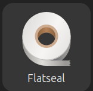
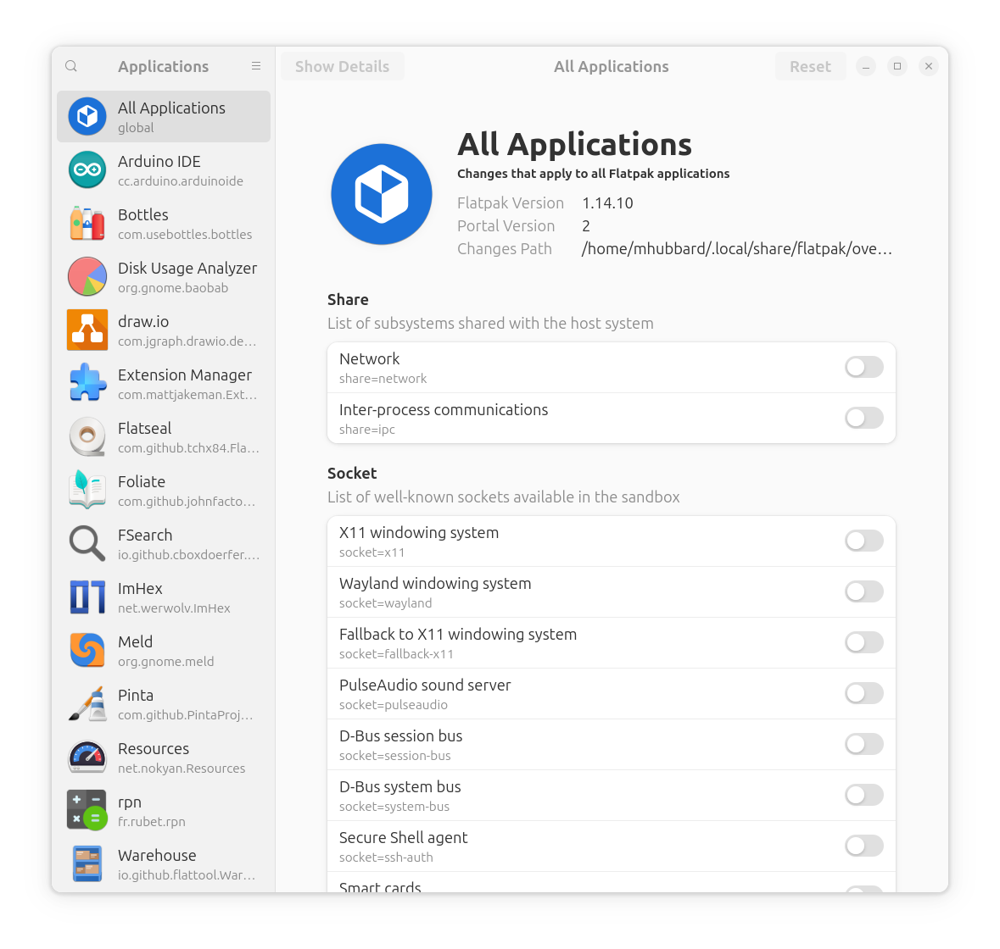

# Fill the Toolbox


----------------------------------------------------------------

:arrow_forward: KEY TAKEAWAYS

- Linux has many different tools for working with files and networks built in.
- Ubuntu is built off of Debian Linux so any tools that are compatible with Debian will probably work on Ubuntu.
- Ubuntu comes with the [The app store for Linux](https://snapcraft.io/) built in. Thousands of applications are available.
- Ubuntu works with [Flat Pack](https://flathub.org/) applications.
- Ubuntu works with [App Images](https://appimage.org/). Linux apps that run anywhere!
- If you are coming from MacOS, you can use [Homebrew](https://docs.brew.sh/Homebrew-on-Linux) to install packages.
- Thousands of networking tools are available on [github](github.com)
- Packet Pushers network maintains a list of [Open Source Networking Projects](https://packetpushers.net/blog/open-source-networking-projects/). Most work on Ubuntu.

----------------------------------------------------------------

## Snaps vs Flatpak vs Appimage

For years Linux distributions have used a `Package Manager` to install applications. On linux, Applications were called packages. The problem with package managers is that Debian/Ubuntu used a different package manager than Redhat/Centos, which used a different package manager than Arch, which used a different package manager than SUSE. And on and on. This meant any developer who wanted to create Linux applications had to create packages for every manager. That was not popular with developers and held Linux adoption back.

To work around this problem, AppImage, Snaps and Flatpaks were developed. It's the old "Pick a standard, any standard" joke. We now have a package installer format that works on all platforms but there are three of them. This article explains the who, and how of the three - [Flatpak vs. Snap vs. AppImage](https://phoenixnap.com/kb/flatpak-vs-snap-vs-appimage).

Most importantly for us is that Snaps were developed by Canonical, the publisher of Ubuntu so it's built into Ubuntu. But Flatpak was developed for Gnome, KDE and FreeDesktop. This was before Ubuntu switched to the Gnome desktop. So the Gnome project has several applications for managing the Gnome desktop. I like the ones listed below, especially for users coming to Ubuntu from Windows. These 4 are very similar to Windows applications.

----------------------------------------------------------------

## Flatpak Applications

The Flatpak store is located [here](https://flathub.org/). There are Thousands of applications that you can browse and install. Most are free open source software (FOSS). Some will have a `Donate` button. If you install the application and find it useful please go back and donate. Most of the applications are written by developers that don't get paid.

### Install Flatpak

Open a terminal (ctrl+alt+t) and run the following commands:

```bash
sudo apt update
sudo apt install flatpak
flatpak remote-add --if-not-exists flathub https://dl.flathub.org/repo/flathub.flatpakrepo
```

Unfortunately you do have to restart after running the commands. Once your system restarts we are going to install four applications for managing the system.

----------------------------------------------------------------

### Gnome Extensions


The first application is `Gnome Extensions`

Gnome Extensions handles updating extensions, configuring extension preferences and removing or disabling unwanted extensions.

**Installation Instructions**

```bash
flatpak install flathub org.gnome.Extensions
```

Once installed you run `Extensions` from the terminal using:

```bash
flatpak run org.gnome.Extensions
```

Or by tapping the Super key, typing extens and clicking on the Extensions icon.

----------------------------------------------------------------

### Gnome Resources

 

Gnome Resources is similar to the Windows Task Manager. Here is a [link](https://apps.gnome.org/Resources/) to the homepage describing Resources.

**Installation Instructions**

```bash
flatpak install flathub net.nokyan.Resources
```

Once installed you run `Resources` from the terminal using:

```bash
flatpak run net.nokyan.Resources
```

Or by tapping the `Super` key, typing res and clicking on the Resources icon.

----------------------------------------------------------------

### Flatseal



Flatseal is a graphical utility to review and modify permissions from your Flatpak applications. This application allows you to look at all your installed Flatpak applications and verify their permissions.

**Installation Instructions**

```bash
flatpak install flathub com.github.tchx84.Flatseal
```

Once installed you run `Flatseal` from the terminal using:

```bash
flatpak run com.github.tchx84.Flatseal
```

Or by tapping the `Super` key, typing flat and clicking on the Flatseal icon.

You will be able to see all of the flatpak applications that are installed when flatseal opens. From the terminal you can run:

```bash
flatpak list --app
```

To see the same list of applications. The `--app` limits the output to just applications. If you omit it, you will see flatpak runtime applications needed to make the flatpak infrastructure work.

Here is a screenshot of the extensions I have installed:

 

----------------------------------------------------------------

### Gnome Disk Usage analyzer


**Installation Instructions**

```bash
flatpak install flathub org.gnome.baobab
```

Once installed you run `Flatseal` from the terminal using:

```bash
flatpak run org.gnome.baobab
```

Or by tapping the `Super` key, typing disk and clicking on the disk icon.

```bash
flatpak run org.gnome.baobab
```

Disk Usage analyzer is similar to disk usage tools on Windows and Mac. Here is a screenshot of the disk usage on my home folder:


I hovered over one of the large blocks and it told me that is the section of disk holding my Inbox. Since my email client is Thunderbird I expanded the `.thunderbird` folder and then I could see `sent mail` and other folders.

----------------------------------------------------------------


----------------------------------------------------------------

Now that we have the four management applications installed let's find some tools useful to a network engineer!

----------------------------------------------------------------

----------------------------------------------------------------

FreeCAD

Draw.io


----------------------------------------------------------------

## The Ubuntu App store

### PacketSender


A cross platform open source tool. Available for Mac, Linux, Windows.

**Features**
Packet Sender can send and receive UDP, TCP, SSL, and DTLS on the ports of your choosing. It also has a built-in HTTP client for GET/POST requests and Panel Generation for the creation of complex control systems.

Common Uses
Packet Sender was designed to be very easy to use while still providing enough features for power users.

• Test automation
Using its command line tool or hotkeys

• Testing network APIs
Using the built-in UDP/TCP/SSL/DTLS clients

• Malware analysis
using the built-in UDP/TCP/SSL/DTLS servers

• Panel Generation
Create single-button panels that trigger a series of commands for control systems.

• Testing HTTP
Single-button GET/POST requests for control systems.

• Intense Traffic
Flood at a particular rate to stress-test devices

• Testing network connectivity/firewalls
by having 2 Packet Senders talk to each other

• Tech support
by sending customers a portable Packet Sender with pre-defined settings and packets

• Security research
Send SSL and then analyze the traffic log.

**Installation Instructions**
