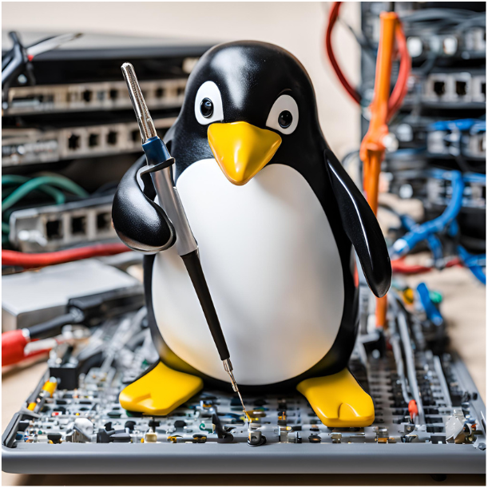
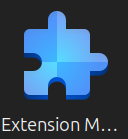
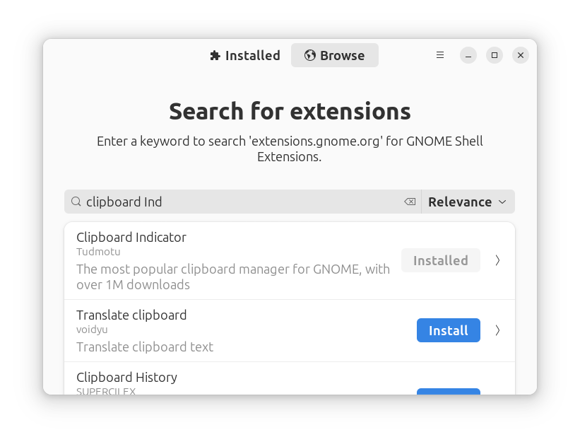
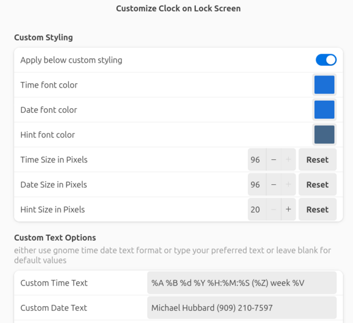
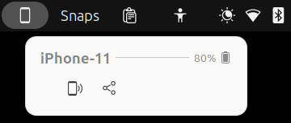
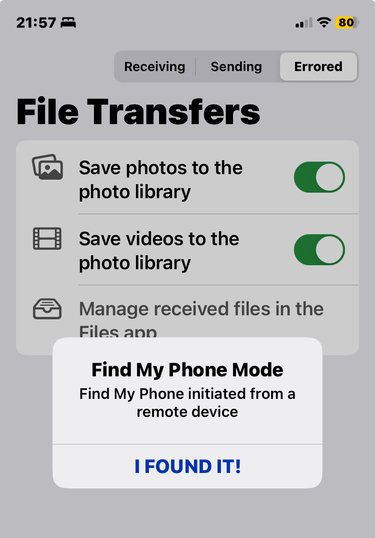

# Gnome Desktop Tools



----------------------------------------------------------------

:arrow_forward: KEY TAKEAWAYS

- Ubuntu is built off of Debian Linux so any tools that are compatible with Debian will probably work on Ubuntu.
- Ubuntu comes with the [The app store for Linux](https://snapcraft.io/) built in. Thousands of applications are available.
- Ubuntu supports [Flat Pack](https://flathub.org/) applications.
- Ubuntu Supports [App Images](https://appimage.org/). Linux apps that run anywhere!
- If you are coming from MacOS, you can use [Homebrew](https://docs.brew.sh/Homebrew-on-Linux) to install packages.
- Thousands of networking tools are available on [github](github.com)
- Packet Pushers network maintains a list of [Open Source Networking Projects](https://packetpushers.net/blog/open-source-networking-projects/). Most work on Ubuntu.

----------------------------------------------------------------

## Introduction

For years Linux distributions have used a `Package Manager` to install applications. On linux, Applications were called packages. The problem with package managers is that Debian/Ubuntu used a different package manager than Redhat/Centos, which used a different package manager than Arch, which used a different package manager than SUSE. And on and on. This meant any developer who wanted to create Linux applications had to create packages for every manager. That was not popular with developers and held Desktop Linux adoption back.

We will cover terminal tools later. In this section we will learn how to install graphical tools using `Flatpaks`, `Snaps` and `Appimages`

----------------------------------------------------------------

## Snaps vs Flatpak vs Appimage

To work around this problem, AppImage, Snaps and Flatpaks were developed. It's the old "Pick a standard, any standard" joke. We now have a package installer format that works on all platforms but there are three of them. This article explains the who, and how of the three - [Flatpak vs. Snap vs. AppImage](https://phoenixnap.com/kb/flatpak-vs-snap-vs-appimage).

Most importantly for us is that Snaps were developed by Canonical, the publisher of Ubuntu so it's built into Ubuntu. But Flatpak was developed for Gnome, KDE and FreeDesktop. This was before Ubuntu switched to the Gnome desktop. So the Gnome project has several applications for managing the Gnome desktop. I like the ones listed below, especially for users coming to Ubuntu from Windows. These 4 are very similar to Windows applications.

----------------------------------------------------------------

## Flatpak Applications

I am going to start with flatpak applications instead of the Ubuntu App Store because there are some flatpak applications that are useful for managing the system.

The Flatpak store is located [here](https://flathub.org/). There are thousands of applications that you can browse and install. Most are free open source software (FOSS). Some will have a `Donate` button. If you install the application and find it useful please go back and donate. Most of the applications are written by developers that don't get paid.

### Gnome Specific

The Gnome project maintains a [site](https://apps.gnome.org/) that contains Flatpak applications designed specifically to enhance the functionality of the Gnome desktop. Apps featured in this curated overview are all built with the GNOME philosophy in mind. They are easy to understand and simple to use, feature a consistent and polished design and provide a noticeable attention to details. Naturally, they are [free software](https://fsfe.org/freesoftware/) and have committed to being part of a [welcoming and friendly community](https://wiki.gnome.org/Foundation/CodeOfConduct). These apps will perfectly integrate with your GNOME Desktop.

 The `Core Apps` are installed by Ubuntu and are worth looking at. The `Characters` application contains smiley faces, symbols, math characters, etc. that you can insert into documents.

The `Fonts` application lists every font available on your system. For coding, I installed `Fira Code` and I can view six different faces of `Fira Code` using the Fonts application.

The `Clocks` application is useful if you work with teams in different time zones. You can add clocks from any time zone in the world. It's very similar to the clocks app on IOS.

There are several more `COre Apps` for you to check out!

----------------------------------------------------------------

### Install Flatpak

Open a terminal (ctrl+alt+t) and run the following commands:

```bash
sudo apt update
sudo apt install flatpak
flatpak remote-add --if-not-exists flathub https://dl.flathub.org/repo/flathub.flatpakrepo
```

Unfortunately you do have to restart after running the commands. Once your system restarts we are going to install four applications for managing the system.

----------------------------------------------------------------

### Gnome Extensions


The first application is `Gnome Extensions`

The Gnome project maintains an [Extensions Site](https://extensions.gnome.org/) where you can install "Extensions". These are small programs that add functionality to the Gnome Desktop. I try to keep the number of extensions to a minimum because of performance and stability issues. This article [Top 21 GNOME Extensions to Enhance Your Experience](https://itsfoss.com/best-gnome-extensions/) lists the extensions that `itsfoss` recommends.

`Gnome Extensions` handles updating extensions, configuring extension preferences and removing or disabling unwanted extensions without using a browser.

**Installation Instructions**

```bash
flatpak install flathub org.gnome.Extensions
```

Once installed you run `Extensions` from the terminal using:

```bash
flatpak run org.gnome.Extensions
```

Or by tapping the Super key, typing `extension` and clicking on the Extensions icon.

Below is a screenshot of the `Gnome Extensions` application running on my laptop:


----------------------------------------------------------------

### Installing Extensions

You can install extensions several ways. This [article from itsfoss](https://itsfoss.com/gnome-shell-extensions/) goes into detail on the different methods. I prefer to use this tool, `Extension Manager` even though it's not written by the Gnome team. It's confusing because it looks just like the `Gnome Extensions` application except that it has the capability to install extensions. I like this method better than using the Chrome browser extension.

**Installation Instructions**

Like all flatpak applications you search [flathub.org](https://flathub.org), click the `Install` button and copy the terminal command.

```bash
flatpak install flathub com.mattjakeman.ExtensionManager
```

Then tap the super key and enter `Extension`, click the icon:



Once `Extensions Manager` opens, click `Browse` at the top and you can search and install `Gnome Extensions`.



You may ask why I installed the Gnome tool when this tool does everything the Gnome tool does and more. That is a good question. Basically I use my laptop every day and consider it a tool. I don't enjoy troubleshooting issues with the tool. Since I'm using the Gnome desktop and Gnome writes a tool to update extensions I use it for updating. Why the official Gnome tool can't do installation is beyond me.

----------------------------------------------------------------

**Below are the four extensions that I have installed:**

- [Clipboard Indicator](https://github.com/Tudmotu/gnome-shell-extension-clipboard-indicator) - The most popular, reliable and feature-rich clipboard manager for GNOME with over 1M downloads
- [Customize Clock on Lock Screen](https://extensions.gnome.org/extension/4663/customize-clock-on-lock-screen/) -  Create Custom Text on the Lock Screen
- [GSConnect](https://github.com/GSConnect/gnome-shell-extension-gsconnect) - With GSConnect you can securely connect to mobile devices
- [Snap Manager lite](https://github.com/fthx/snap-manager-lite) - Popup menu in the top bar to easily manage usual snap tasks (list, changes, refresh, remove, install...)

----------------------------------------------------------------

#### Clipboard Indicator

There are a lot of clipboard managers out there. I went with this one because it is a Gnome extension (There are installable applications available) and had good ratings. As always, there are security implications when using a clipboard manager. I felt that the convenience offsets the risk but you have to decide for yourself if it's worth the risk.

Here is what it looks like in use:


Clicking on `Settings` brings up a dialog with tons of options. The :material-dots-vertical: icon in `Gnome Extensions` exposes the settings menu. The only option I changed is `Notifications, show notification on copy` so that I get a popup message when I copy something to the clipboard.

----------------------------------------------------------------

#### Customize Clock on Lock Screen

Since my laptop is at customer locations most of the time I love this extension. It allows me to put my name and phone number on the lock screen.

!!! Note
    The shortcut keys to lock the screen are `super+l`. That's a lowercase `el`.

Here are the settings I use. The :material-dots-vertical: icon in `Gnome Extensions` exposes the settings menu.



----------------------------------------------------------------

That puts the following text on the lock screen:


----------------------------------------------------------------

If you want to use the same settings for time:

```bash
%A %B %d, %Y %H:%M:%S (%Z) - week %V
```

The week number is very popular in Europe. After I worked in France for awhile I find that I like it. In meetings you can say "in week 48 we need to accomplish the following" and everyone knows what dates you mean. There are widgets and applications for IOS and Android to show Weeks if you want to quickly see what a week number translates to on a calendar.

----------------------------------------------------------------

#### GSConnect

If you use an Android phone this application is a must! It allows you to send/receive text messages, send files to the phone, and much more. iPhone is more limited because Apple won't allow iMessages support. But with RCS rolling out in IOS 18 that might change.

One nice feature that works on IOS and Android is `find my phone`! I always misplace my phone when working in closets and with GSConnect I can quickly make it ring to locate it.

**Open GSConnect Settings**

The :material-dots-vertical: icon in `Gnome Extensions` expose the settings menu:


----------------------------------------------------------------

#### Install KDE Connect

GSConnect is a Gnome port of the KDE Connect application. On the settings dialog you will see links to:

- Android Play Store
- Apple App Store
- Sailfish OS OpenRepos
- F-Droid

Go the the appropriate store and install the KDE Connect application on your phone.

!!! Note
    On IOS you will be notified that KDE Connect is installed using a program called `TestFlight` that Apple uses for experimental Applications.

Open the KDE Connect application on your phone and follow the instructions for connecting to GSConnect.

From the Settings dialog you will see all devices that have connected and their status:


I enabled the `GSConnect remains active when Gnome Shell is locked` slider so that the phone remains connected when I lock the desktop.

----------------------------------------------------------------

The icon for GSConnect is in the menu bar at the top right of the screen:



You can see `Find My` and `Share` in the screenshot. The `Find my phone` will keep ringing until you press the `I Found It` button on the phone.

----------------------------------------------------------------



----------------------------------------------------------------

#### Snap Manager Lite

This extension allows you to install and manage snaps:


One annoying feature of snaps is that they install as `Loop` devices. This means that when you run `lsblk` from the terminal to view your disks you seen a lot of `loop` entries. To avoid this, use this instead:

```bash
lsblk -e7
```

You could create an alias in the `.bahsrc` or `.zshrc` file using:

```bash
alias lsblk='lsblk -e7'
```

If you don't want to have to type the `-e7`.

----------------------------------------------------------------

### Gnome Resources

 

Gnome Resources is similar to the Windows Task Manager. Here is a [link](https://apps.gnome.org/Resources/) to the homepage describing Resources.

**Installation Instructions**

```bash
flatpak install flathub net.nokyan.Resources
```

Once installed you run `Resources` from the terminal using:

```bash
flatpak run net.nokyan.Resources
```

Or by tapping the `Super` key, typing res and clicking on the Resources icon.

Here is a screenshot of the Processes tab. Just like in the Windows Task Manager, you can right click on a process and get a menu of actions to perform:


Unlike the Windows Task Manager, you have a clean menu on the side where you can select the following resources:

- Apps - the apps that are running
- Processes - the processes that are running
- Processor - The CPU AND GPU percentages
- Memory - The amount of memory applications are using
- GPU1 - The utilization of GPU1
- GPU2 - The utilization of GPU2
- Disk activity - Activity of each internal disk
- Network - Ethernet utilization
- WiFI - Utilization of the WiFI adapter
- Battery - Battery usage and properties

I think we can agree this is a useful tool!

----------------------------------------------------------------

### Flatseal


Flatseal is a graphical utility to review and modify permissions from your Flatpak applications. This application allows you to look at all your installed Flatpak applications and verify their permissions.

**Installation Instructions**

```bash
flatpak install flathub com.github.tchx84.Flatseal
```

Once installed you run `Flatseal` from the terminal using:

```bash
flatpak run com.github.tchx84.Flatseal
```

Or by tapping the `Super` key, typing flat and clicking on the Flatseal icon.

You will be able to see all of the flatpak applications that are installed when flatseal opens. From the terminal you can run:

```bash
flatpak list --app
```

To see the same list of applications. The `--app` limits the output to just applications. If you omit it, you will see flatpak runtime applications needed to make the flatpak infrastructure work.

#### flatpaks with Instructions

If you want to install the flatpak applications on a different machine, run the following command and then copy the lines with `flatpak install` to the new machine.

```bash hl_lines='1'
flatpak list --app | sed -e "s/^[^\t]*//" -e "s/^\t/flatpak install /" -e "s/\t.*$//"
flatpak install cc.arduino.arduinoide
flatpak install com.github.PintaProject.Pinta
flatpak install com.github.johnfactotum.Foliate
flatpak install com.github.tchx84.Flatseal
flatpak install com.jgraph.drawio.desktop
flatpak install com.mattjakeman.ExtensionManager
flatpak install com.usebottles.bottles
flatpak install fr.rubet.rpn
flatpak install io.github.cboxdoerfer.FSearch
flatpak install io.github.flattool.Warehouse
flatpak install net.nokyan.Resources
flatpak install net.werwolv.ImHex
flatpak install org.gnome.baobab
flatpak install org.gnome.meld
```

Here is a screenshot of the flatpak applications I have installed:

 

----------------------------------------------------------------

### Gnome Disk Usage analyzer


**Installation Instructions**

```bash
flatpak install flathub org.gnome.baobab
```

Once installed you run `Flatseal` from the terminal using:

```bash
flatpak run org.gnome.baobab
```

Or by tapping the `Super` key, typing disk and clicking on the disk icon.

```bash
flatpak run org.gnome.baobab
```

Disk Usage analyzer is similar to disk usage tools on Windows and Mac. Here is a screenshot of the disk usage on my home folder:


I hovered over one of the large blocks and it told me that is the section of disk holding my Inbox. Since my email client is Thunderbird I expanded the `.thunderbird` folder and then I could see `sent mail` and other folders.

----------------------------------------------------------------


----------------------------------------------------------------

## Wrapping up

Now that we have the these extensions and applications installed I hope you find Ubuntu with the Gnome desktop easy to manage. In the next chapter we will install some applications from the Ubuntu App store, some more flatpaks and some Appimages.
