# Gnome Desktop Tools

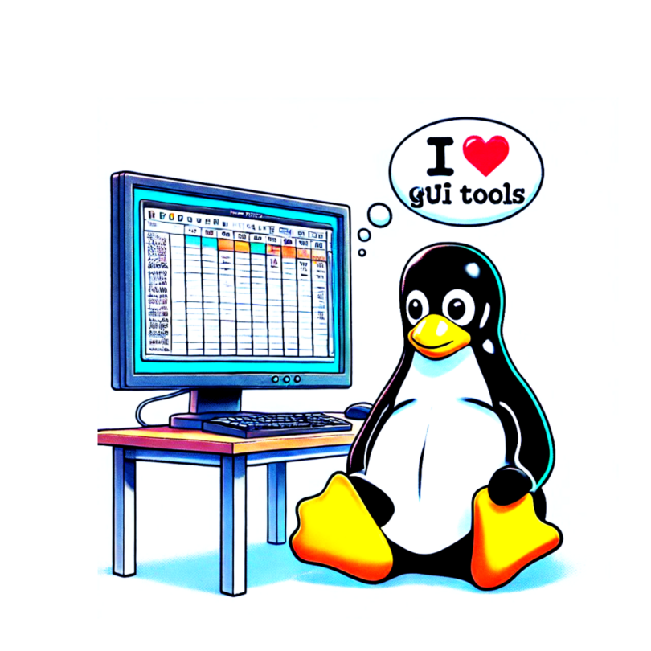

----------------------------------------------------------------

:arrow_forward: KEY TAKEAWAYS

- Ubuntu is built off of Debian Linux, so tools that are compatible with Debian will probably work on Ubuntu.
- Ubuntu comes with the The App Center built in. Thousands of applications are available. To open - Tap `Superkey`, type `App`, press `Enter`.
- Ubuntu supports the Gnome Project's [Flat Pack](https://flathub.org/) applications.
- Ubuntu supports [App Images](https://appimage.org/). Linux apps that run anywhere!
- If you are coming from MacOS, you can use [Homebrew](https://docs.brew.sh/Homebrew-on-Linux) to install packages.
- Thousands of networking tools are available on [github](github.com)
- The [Packet Pushers](https://packetpushers.net) network maintains a list of [Open Source Networking Projects](https://packetpushers.net/blog/open-source-networking-projects/). Most work on Ubuntu.

----------------------------------------------------------------

## Introduction

**About GNOME on Ubuntu**

Ubuntu Desktop comes installed with a slightly modified version of the GNOME Desktop Environment. Here is a list of the notable differences between GNOME on Ubuntu and "Vanilla" GNOME.

- Ubuntu comes with Firefox instead of the GNOME Web browser.
- Ubuntu comes with the Remmina remote desktop client instead of GNOME Connections.
- The AppIndicators extension is included. This extension will enable icons in the top right corner of some applications.
- The Ubuntu Dock extension is included. This extension provides the left sidebar for running applications.
- The Desktop Icons NG extension is included. This extension enables the use of icons on the desktop.
- In addition to Ubuntu desktop wallpapers, the default theme is Yaru and the default font is Ubuntu.
- Minimize and maximize buttons are included on window title bars.

### Getting Help

You can tap the superkey and type `help` to open Ubuntu's Desktop Guide. If you are new to Ubuntu, I highly recommend that you review it.

----------------------------------------------------------------

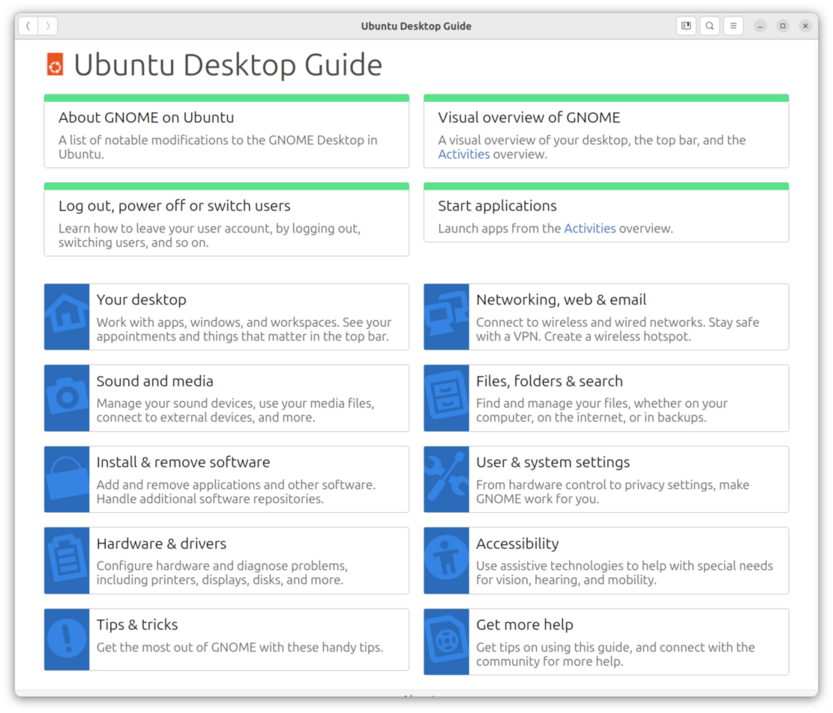

----------------------------------------------------------------

## Package managers

On linux, Applications are commonly referred to as packages. For years Linux distributions have used a `Package Manager` to install applications. The problem with package managers is that Debian/Ubuntu used a different package manager than Redhat/Centos, which used a different package manager than Arch, which used a different package manager than SUSE. And on and on. This meant any developer who wanted to create Linux applications had to create packages for every manager. That was not popular with developers and held Desktop Linux adoption back.

----------------------------------------------------------------

## Snaps vs Flatpak vs Appimage

To work around this problem there are three universal package systems:

- Snaps
- Flatpaks
- AppImages

 It's the old "Pick a standard, any standard" joke. We now have a package installer format that works on all platforms, but there are three of them. This article explains the who, and how of the three - [Flatpak vs. Snap vs. AppImage](https://phoenixnap.com/kb/flatpak-vs-snap-vs-appimage).

Most importantly for us is that Canonical, the publisher of Ubuntu, developed the Snap infrastructure so it's built into Ubuntu. Gnome, KDE and FreeDesktop created Flatpak in September 2015. This is before Ubuntu switched to the Gnome desktop in October 2017. AppImage is an open source community project not affiliated with Canonical or The Gnome project.

The Gnome project created dedicated applications for managing the Gnome desktop. I like the ones listed [below](CH02-Install-Tools.md/#gnome-specific), especially for users coming to Ubuntu from Windows. Gnome Resources and Disk Analyzer are similar to the Windows applications for managing resources and disk usage.

We will cover terminal tools later. In this section we will learn how to install graphical tools using `Flatpaks`.

----------------------------------------------------------------

## Flatpak

I am going to start with flatpak applications instead of the Ubuntu App Store because there are some flatpak applications that are useful for managing the system.

Visit the Flatpak store by clicking this link [Flathub](https://flathub.org/). There are thousands of applications that you can browse and install. Most are free open source software (FOSS). Some will have a `Donate` button. If you install the application and find it useful, please go back and donate. Most of the developers don't get paid for their time.

----------------------------------------------------------------

### Install Flatpak

Open a terminal (ctrl+alt+t) and run the following commands:

```bash
sudo apt update
sudo apt install flatpak
flatpak remote-add --if-not-exists flathub https://dl.flathub.org/repo/flathub.flatpakrepo
```

**Explanation**

- sudo apt update - This uses the `Aptitude` package manager to update the repositories that your machine uses.
- sudo apt install flatpak - This uses the `Aptitude` package manager to actually install flatpak.
- flatpak remote-add - This uses the `Aptitude` package manager to add the remote flatpak repository. This allows the flatpaks to receive updates.

!!! Note
    Unfortunately you do have to restart after running the commands. There is no "Reboot Now" message but flatpak will not be available until you reboot.

Once your system restarts we are going to install a few flatpak applications for managing the system and making life better!.

----------------------------------------------------------------

#### Gnome Specific

The Gnome project maintains a [site](https://apps.gnome.org/) that contains Flatpak applications designed specifically to enhance the functionality of the Gnome desktop. Apps featured in this curated overview are all built with the GNOME philosophy in mind. They are easy to understand, simple to use, feature a consistent and polished design and provide a noticeable attention to details. Naturally, they are [free software](https://fsfe.org/freesoftware/) and have committed to being part of a [welcoming and friendly community](https://wiki.gnome.org/Foundation/CodeOfConduct). These apps will perfectly integrate with your GNOME Desktop.

#### Gnome Core Apps

 Several of the the 28 `Core Apps` are installed by Ubuntu by default and are worth looking at. Here are descriptions of five that I find useful. To open them, tap the super key and type the name of the application you want to open.

- The `Characters` application contains smiley faces, symbols, math characters, etc. that you can insert into documents.
- The `Fonts` application lists every font available on your system. For coding, I installed `Fira Code` and I can view the six different faces of `Fira Code` using the Fonts application.
- The `Clocks` application is useful if you work with teams in different time zones. You can add clocks from any time zone in the world. Also included are an Alarm, Stopwatch, amd Timer. It's very similar to the clocks app on Apple IOS.
- The `System Monitor` application is similar to the `Gnome Resources` application but not as comprehensive. It's worth looking at. Below is a screenshot of the System Monitor application.

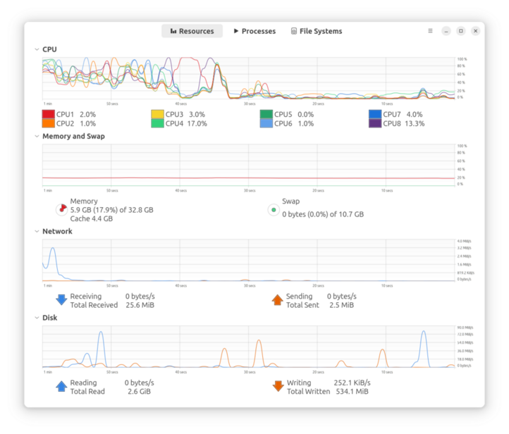

----------------------------------------------------------------

- The `Logs` application allows you to quickly look at system logs. It's a super fast way to look for issues. If the log has a URL for support, it will be shown.

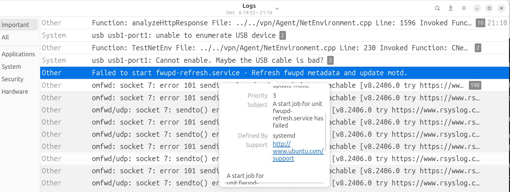

----------------------------------------------------------------

#### Gnome Circle Apps

GNOME Circle champions the great software that is available for the GNOME platform. Not only do we showcase the best apps and libraries for GNOME, but we also support independent developers who are using GNOME technologies.

GNOME Circle contains applications extending the GNOME ecosystem. It champions the great additional software that is available for the GNOME platform. [Learn more about GNOME Circle](https://circle.gnome.org/).

One Circle application that is basically mandatory is `Impression`, an application to write ISO images to a flash drive! Simply start `Impression`, pick the image, pick the USB flash drive, click `write`.

In the screenshot below, I picked the the Windows 11 image from my ~/Downloads directory and selected the Aruba flash drive to write it to. All that is left is to click on `Write` and a bootable flash drive will be created.


----------------------------------------------------------------

**Installation Instructions**

```bash
flatpak install flathub io.gitlab.adhami3310.Impression
```

----------------------------------------------------------------

### Gnome Extensions


The Gnome project maintains an [Extensions Site](https://extensions.gnome.org/) where you can install "Extensions". These are small programs that add functionality to the Gnome Desktop. I try to keep the number of extensions to a minimum because of performance and stability issues. This article [Top 21 GNOME Extensions to Enhance Your Experience](https://itsfoss.com/best-gnome-extensions/) lists the extensions that `itsfoss` recommends.

In the past, you used Google Chrome or Mozilla Firefox to install Gnome extensions. This was a painful process I thought and you had to install a chrome or Mozilla Firefox `Connector` first.

I prefer to use an flatpak named `Gnome Extensions` to install extensions. This is a flatpak written by the Gnome Project so I am comfortable using it. `Gnome Extensions` handles updating extensions, configuring extension preferences and removing or disabling unwanted extensions without using a browser. For some reason, Gnome Extensions does not have the ability to install extensions. We will install the similarly named `Extensions Manager` that has the ability to install extensions.

----------------------------------------------------------------

**Installation Instructions**

```bash
flatpak install flathub org.gnome.Extensions
```

Once installed, run `Extensions` from the terminal using:

```bash
flatpak run org.gnome.Extensions
```

Or by tapping the Super key, typing `extension` and clicking on the Extensions icon.

Below is a screenshot of the `Gnome Extensions` application running on my laptop:

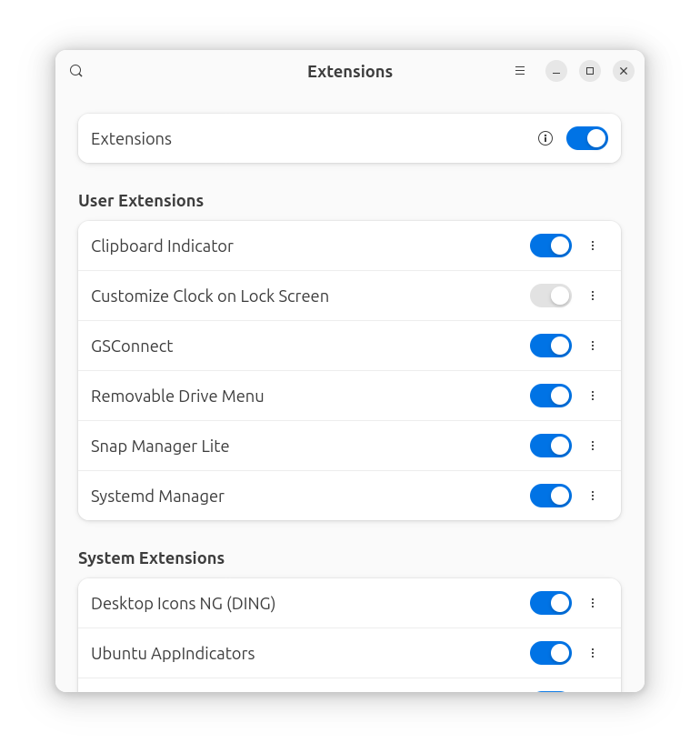

----------------------------------------------------------------

### Installing Extensions

You can install extensions several ways. This [article from itsfoss](https://itsfoss.com/gnome-shell-extensions/) goes into detail on the different methods. I prefer to use this tool, `Extension Manager` even though it's not written by the Gnome team. It's confusing because it looks just like the `Gnome Extensions` application except that it has the capability to install extensions. I like this method better than using the Chrome browser extension.

----------------------------------------------------------------

**Installation Instructions**

Like all flatpak applications you search [flathub.org](https://flathub.org), click the `Install` button and copy the terminal command.

```bash
flatpak install flathub com.mattjakeman.ExtensionManager
```

Then tap the super key and enter `Extension`, click the icon:


Once `Extensions Manager` opens, click `Browse` at the top and you can search and install `Gnome Extensions`.


You may ask why I installed the Gnome tool when this tool does everything the Gnome tool does and more. That is a good question. Basically I use my laptop every day and consider it a tool. I don't enjoy troubleshooting issues with the tool. Since I'm using the Gnome desktop, and Gnome writes a tool to update extensions I use it for updating. Why the official Gnome tool can't do installation is beyond me.

----------------------------------------------------------------

**Below are the extensions that I have installed:**

- [Clipboard Indicator](https://github.com/Tudmotu/gnome-shell-extension-clipboard-indicator) - The most popular, reliable and feature-rich clipboard manager for GNOME with over 1M downloads
- [Customize Clock on Lock Screen](https://extensions.gnome.org/extension/4663/customize-clock-on-lock-screen/) -  Create Custom Text on the Lock Screen
- [GSConnect](https://github.com/GSConnect/gnome-shell-extension-gsconnect) - With GSConnect you can securely connect to mobile devices
- [Removable Drive Menu](https://extensions.gnome.org/extension/7/removable-drive-menu/) - A status menu for accessing and unmounting removable devices.
- [Snap Manager lite](https://github.com/fthx/snap-manager-lite) - Popup menu in the top bar to easily manage usual snap tasks (list, changes, refresh, remove, install...)
- [Systemd Manager](https://github.com/hardpixel/systemd-manager) - Systemd Manager is a Gnome Shell Extension which allows you to start/stop systemd services via a menu in the status area in the top panel. You can preselect which services should be shown in the extension preferences dialog.

!!! Tip
    From the terminal you can list the installed extensions
    ```bash
    gnome-extensions list -d --enabled | grep 'Name:' | sed 's/  Name: //'
    ```

Here is the output of the command:

```bash hl_lines='1'
gnome-extensions list -d --enabled | grep 'Name:' | sed 's/  Name: //'
Customize Clock on Lock Screen
Systemd Manager
Removable Drive Menu
Clipboard Indicator
GSConnect
Snap Manager Lite
Ubuntu AppIndicators
Ubuntu Dock
Desktop Icons NG (DING)
Ubuntu Tiling Assistant
```

----------------------------------------------------------------

#### Clipboard Indicator

There are a lot of clipboard managers out there. I went with this one because it is a Gnome extension and it had good ratings. There are installable applications available but I liked the having an extension that is managed along with the other extensions I use. As always, there are security implications when using a clipboard manager. I felt that the convenience offsets the risk, you have to decide for yourself if it's worth the risk.

Here is what it looks like in use:

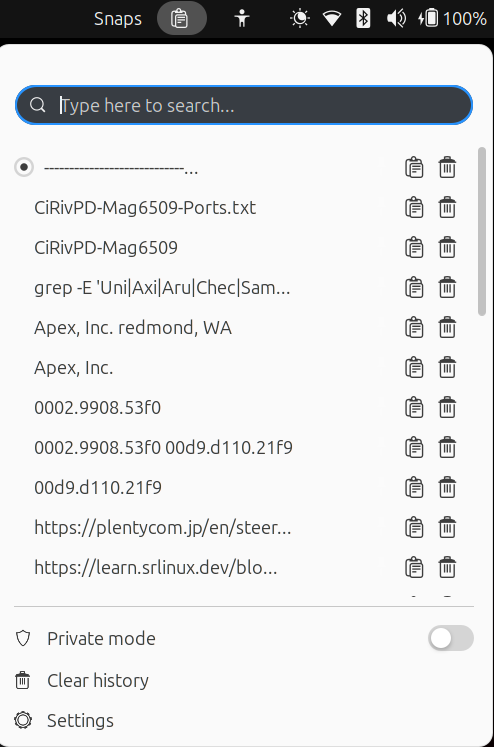

Clicking on `Settings` brings up a dialog with tons of options. The :material-dots-vertical: icon in `Gnome Extensions` exposes the settings menu. The only option I changed is `Notifications, show notification on copy` so that I get a popup message when I copy something to the clipboard.

----------------------------------------------------------------

**Installation Instructions**

Open the Extension Manager flatpak, click the `Browse` tab at the top, then type `clipboard indicator`. Once Extension Manager finds `Clipboard Indicator` click on the `Install...` button.

----------------------------------------------------------------

#### Customize Clock on Lock Screen

Since my laptop is at customer locations most of the time, I love this extension. It allows me to put my name and phone number on the lock screen like macOS!

!!! Note
    The shortcut keys to lock the screen are `super+l`. That's a lowercase `el`.

Here are the settings I use. The :material-dots-vertical: icon in `Gnome Extensions` exposes the settings menu.


----------------------------------------------------------------

That puts the following text on the lock screen:


----------------------------------------------------------------

If you want to use the same settings for time:

```bash
%A %B %d, %Y %H:%M:%S (%Z) - week %V
```

The week number is very popular in Europe. After I worked in France for awhile I find that I like it. In meetings you can say "in week 48 we need to accomplish the following" and everyone knows what dates you mean. There are widgets and applications for IOS and Android to show Weeks if you want to quickly see what a week number translates to on a calendar.

----------------------------------------------------------------

**Installation Instructions**

Open the Extension Manager flatpak, click the `Browse` tab at the top, then type `customize clock on Lock Screen`. Once Extension Manager finds `customize clock on Lock Screen` click on the `Install...` button.

----------------------------------------------------------------

#### GSConnect

If you use an Android phone this application is a must! It allows you to send/receive text messages, send files to the phone, and much more. iPhone is more limited because Apple won't allow iMessages support. But with RCS rolling out in IOS 18 that might change.

One nice feature that works on IOS and Android is `find my phone`! I always misplace my phone when working in closets and with GSConnect I can quickly make it ring to locate it.

!!! Note
    The phone and laptop have to be connected to the same network. This usually isn't an issue but if the customer doesn't allow you to connect then `Find My Phone` will fail.

**Open GSConnect Settings**

The :material-dots-vertical: icon in `Gnome Extensions` exposes the settings menu:


----------------------------------------------------------------

#### Install KDE Connect

GSConnect is a Gnome port of the KDE Connect application. On the GSConnect settings dialog you will see links to:

- Android Play Store
- Apple App Store
- Sailfish OS OpenRepos
- F-Droid

Go to the appropriate store for your phone and install the KDE Connect application on your phone.

!!! Note
    On IOS you will be notified that KDE Connect is installed using a program called `TestFlight` that Apple uses for experimental Applications.

Open the KDE Connect application on your phone and follow the instructions for connecting to GSConnect.

From the GSConnect Settings dialog you will see all devices that have ever connected and their status:

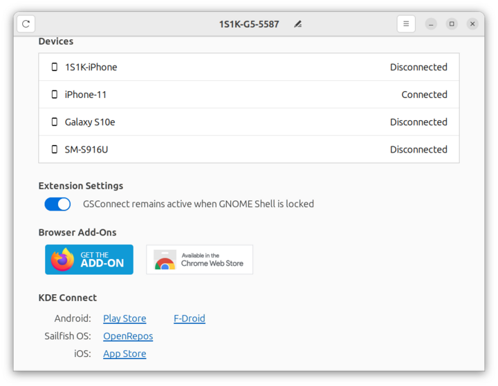

I enabled the `GSConnect remains active when Gnome Shell is locked` slider so that the phone remains connected when I lock the desktop.

----------------------------------------------------------------

----------------------------------------------------------------phone can connect to GSConnect. Open the terminal and paste the following commands in:

```bash hl_lines='1 2 3'
sudo ufw allow 1716:1764/tcp
sudo ufw allow 1716:1764/udp
sudo ufw show added

[output]
Added user rules (see 'ufw status' for running firewall):
ufw allow 1716:1764/tcp
ufw allow 1716:1764/udp
```

----------------------------------------------------------------

### Removable Drive menu

On some projects I end up using flash drives quite a lot. All this extension does is puts the `Eject Drive` icon  in the status menu. But I find useful when I'm not in `Files` and want to work with the files on a flash drive or eject a drive.

----------------------------------------------------------------

**Installation Instructions**

Open the Extension Manager flatpak, click the `Browse` tab at the top, then type `Removable Drive Menu`. Once Extension Manager finds `Removable Drive Menu` click on the `Install...` button.

Now, any time a flash drive is installed, the Removable Drive icon will be in the status menu. Simply click the icon, then select the drive to eject!

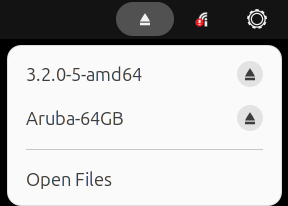

----------------------------------------------------------------

#### Snap Manager Lite

This extension allows you to install and manage snaps:

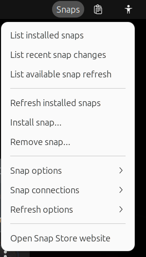

!!! Warning
    For some reason `Snap Manager Lite` is not available for Gnome 46/Ubuntu 24.04. It is available for 22.04, 23.10, 24.10.

----------------------------------------------------------------

One annoying feature of snaps is that they install as [Loop devices](https://itsfoss.com/loop-device-linux/). This means that when you run `lsblk` from the terminal to view your disks you see a lot of `loop` entries.

```bash hl_lines="1"
lsblk
NAME        MAJ:MIN RM   SIZE RO TYPE MOUNTPOINTS
loop0         7:0    0   9.5M  1 loop /snap/asciinema/35
loop1         7:1    0  11.6M  1 loop /snap/auto-cpufreq/146
loop2         7:2    0  76.5M  1 loop /snap/aurora-editor/55
loop3         7:3    0   9.4M  1 loop /snap/asciinema/32
loop4         7:4    0  11.6M  1 loop /snap/auto-cpufreq/147
```

To avoid this, add the -e7 flag:

```bash
lsblk -e7
```

You can add an alias in the `.bahsrc` or `.zshrc` file using:

```bash
alias lsblk='lsblk -e7'
```

If you don't want to have to type the `-e7`.

----------------------------------------------------------------

### Systemd Manager

Systemd is a system and service manager for Linux operating systems. There are hundreds of services running on the system and usually terminal commands are used to start/stop/enable and check status. There are a few services like the `UFW Firewall`, `ssh server` and `tftp server` that I turn on and off often. The `Systemd Manager` extensions lets me easily check the status from the `status menu`. The icon looks like the Gnome setting gear - .

----------------------------------------------------------------

**Installation Instructions**

This extension isn't available using the `Extension Manager` flatpak. There appears to be some friction between the developer and the Gnome Project. At least that's what it seemed like on the Github Issues page. So far I have not had any problems with the extension. Follow these instructions to install.

Click this link [Systemd Manager](https://github.com/hardpixel/systemd-manager) to download the zip file of release V17. Version 17 supports Gnome 45/46/47.

Right click on the zip file and select `Extract To..`. In the Files dialog that opens search for `~/.local/share/gnome-shell/extensions` and click `Select`. This will extract the file into a folder named `systemd-manager-v17` under the `extensions` directory. Locate the folder in Files and rename it to `systemd-manager@hardpixel.eu`

You will need to restart Ubuntu to activate the extension.

One of files in the directory is named `metadata.json` Below are the contents of the json file. You can see the shell version the extension works with and the uuid. The uuid is the required name of the directory containing the extension's configuration files. I right clicked on `metadata.json` and used `Text Edit` to open the configuration file.

```json
{
  "shell-version": ["45", "46", "47"],
  "uuid": "systemd-manager@hardpixel.eu",
  "url": "https://github.com/hardpixel/systemd-manager",
  "settings-schema": "org.gnome.shell.extensions.systemd-manager",
  "gettext-domain": "systemd-manager",
  "version": 17,
  "name": "Systemd Manager",
  "description": "Toggle systemd services on/off from a popup menu in the top gnome panel. Can be used to start services like apache2, mysql, postgres. It uses `pkexec' to run `sytemctl'. If you want to start services without entering a password you have to polkit policy file. An example policy file can be found in the github repository.",
  "donations": {
    "github": "jonian"
  }
}
```

#### Configuration

Click on the `Systemd-Manager` icon in the status menu and select `Add Service`. Here is what it will look like:

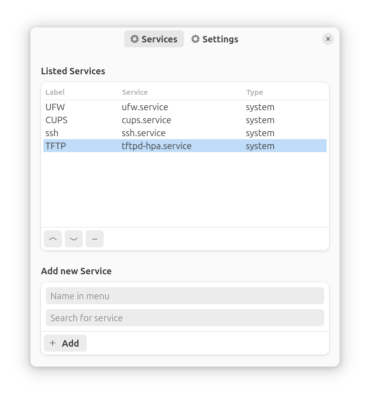

----------------------------------------------------------------

Type a name for the service in the `Name in menu` field and enter the service in the `Search for service` field. Click the `+ Add` button and then click the `X` at the top right corner of the dialog to close it.

Now click the `Systemd-Manager` icon in the `status menu` and you will see the services you added.

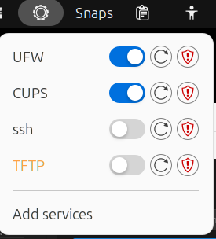

----------------------------------------------------------------

Simply slide the slider to the right to enable a service or to the left to disable a service. You can also restart a service by clicking the icon with the circular arrow or mask a service by clicking the icon on the right.

#### Why the Red

Notice that the TFTP entry is red. I wasn't sure what that meant so I ran the following command from a terminal:

```bash
sudo systemctl restart tftpd-hpa
```

And received a message that the service couldn't be started. I ran the following command to view the journal for tftpd-hpa:

```bash
journalctl -u tftpd-hpa
```

And found that tftpd-hpa had been failing since I upgraded to 24.10 on November 17th! I Googled the error message but nothing really jumped out so I did the following:

```bash
sudo cp /etc/default/tftpd-hpa /etc/default/tftpd-hpa.bak
sudo dpkg --purge --force-all tftpd-hpa
sudo apt install tftpd-hpa
sudo cp /etc/default/tftpd-hpa.bak /etc/default/tftpd-hpa
sudo systemctl is-enabled tftpd-hpa
sudo systemctl start tftpd-hpa
```

Those commands did the following

- made a backup of the tftpd-hpa configuration file
- removed the tftpd-hpa service and the configuration file
- reinstalled the tftpd-hpa service
- copied the tftpd-hpa configuration file from the backup
- verified that the tftpd-hpa was enabled so that it could start after a reboot
- started the tftpd-hpa service

Now when I click on the Systemd-Manager icon the TFTP entry is black

----------------------------------------------------------------

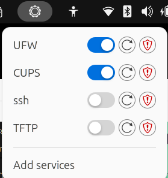

----------------------------------------------------------------

## Flatpak Applications

Now that we have the Gnome Extensions installed let's install some Flatpak applications that you might call "Quality of Life" improvements! I listed them in alphabetical order order, not the order that you will use the most!

- [Disk Usage Analyzer](CH02-Install-Tools.md/#disk-usage-analyzer) - A GUI disk Space analyzer tool
- [Draw.io](CH02-Install-Tools.md/#drawio) - A flexible and privacy-focused production grade diagramming tool.
- [Flatseal](CH02-Install-Tools.md/#flatseal) - A tool to manage flatpak security settings
- [Foliate](CH02-Install-Tools.md/#foliate) - An ebook reader
- [KolourPaint](CH02-Install-Tools.md/#kolourpaint) - A simple painting program to quickly create raster images.
- [Meld](CH02-Install-Tools.md/#meld) - A great diffing tool
- [Pinta](CH02-Install-Tools.md/#pinta) - An image editing, drawing and painting application
- [Resources](CH02-Install-Tools.md/#resources) - A system resource monitor
- [Warehouse](CH02-Install-Tools.md/#warehouse) - A tool to manage every aspect of Flatpak applications

----------------------------------------------------------------

### Disk Usage analyzer


----------------------------------------------------------------

**Installation Instructions**

```bash
flatpak install flathub org.gnome.baobab
```

Once installed, run  `Flatseal` from the terminal using:

```bash
flatpak run org.gnome.baobab
```

Or by tapping the `Super` key, typing disk and clicking on the disk icon.

Disk Usage analyzer is similar to disk usage tools on Windows and Mac. Here is a screenshot of the disk usage on my home folder:

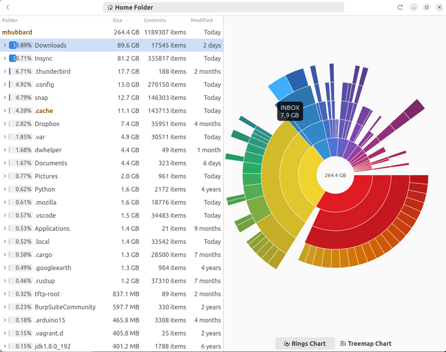

I hovered over one of the large blocks and it told me that is the section of disk holding my Inbox. Since my email client is Thunderbird, I expanded the `.thunderbird` folder and then I could see `sent mail` and other folders. I prompted me to delete some email!

----------------------------------------------------------------


----------------------------------------------------------------

### Draw.io

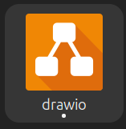

----------------------------------------------------------------

**Create and share diagrams**

draw.io is the most flexible and privacy-focused of any production grade diagramming tool. Create flowcharts, process diagrams, org charts, UML, ER diagrams, network diagrams and much more.

----------------------------------------------------------------

**Installation Instructions**

```bash
flatpak install flathub com.jgraph.drawio.desktop
```

Once installed, run  `Drawio` from the terminal using:

```bash
flatpak run com.jgraph.drawio.desktop
```

Or by tapping the `Super` key, typing `drawio` and clicking on the `Drawio` icon.

----------------------------------------------------------------

When you launch Drawio, these are the choices for getting started:

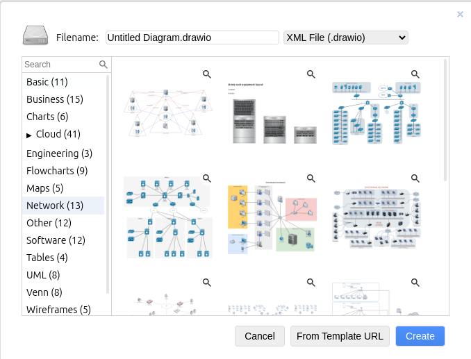

As you can see, there are a lot of built in templates. You select one of the built-in templates or select `Blank Diagram` to start from scratch.

[The Drawio Project homepage](https://www.drawio.com/)

----------------------------------------------------------------

### Flatseal


----------------------------------------------------------------

Flatseal is a graphical utility to review and modify permissions from your Flatpak applications. This application allows you to look at all of your installed Flatpak applications and verify their permissions.

----------------------------------------------------------------

**Installation Instructions**

```bash
flatpak install flathub com.github.tchx84.Flatseal
```

Once installed, run `Flatseal` from the terminal using:

```bash
flatpak run com.github.tchx84.Flatseal
```

Or by tapping the `Super` key, typing `flatseal` and clicking on the Flatseal icon.

You will be able to see all of the flatpak applications that are installed when flatseal opens.

#### List flatpaks in terminal

```bash
flatpak list --app
```

To see the same list of applications. The `--app` limits the output to just applications. If you omit it, you will see flatpak runtime applications needed to make the flatpak infrastructure work.

#### flatpaks with Instructions

If you want to install the flatpak applications on a different machine, for example a VM, run the following command and then copy the lines with `flatpak install` to the new machine.

```bash hl_lines='1'
flatpak list --app | sed -e "s/^[^\t]*//" -e "s/^\t/flatpak install /" -e "s/\t.*$//"
flatpak install cc.arduino.arduinoide
flatpak install com.github.PintaProject.Pinta
flatpak install com.github.johnfactotum.Foliate
flatpak install com.github.tchx84.Flatseal
flatpak install com.jgraph.drawio.desktop
flatpak install com.mattjakeman.ExtensionManager
flatpak install fr.rubet.rpn
flatpak install io.github.cboxdoerfer.FSearch
flatpak install io.github.flattool.Warehouse
flatpak install io.gitlab.adhami3310.Impression
flatpak install net.nokyan.Resources
flatpak install net.werwolv.ImHex
flatpak install org.gnome.baobab
flatpak install org.gnome.meld
flatpak install org.kde.kolourpaint
```

Here is a screenshot of the flatpak applications I have installed:

 

----------------------------------------------------------------

### Launch flatpaks with a script

If you were wondering why I included the terminal command with each flatpak when they are GUI applications, it's because you might want to create a script and launch several at once. For example, let's say you want to launch `Foliate`, `KolourPaint`, and `Meld` every time you start up your laptop.

First we need to open an editor and create a shell script.

```bash
#!/bin/zsh

flatpak run com.github.johnfactotum.Foliate
flatpak run org.kde.kolourpaint
flatpak run org.gnome.meld
```

Save the file as `morning.sh`

**Make the file executable**

```bash
chmod +x morning.sh
```

**Run the script**

```bash
./morning.sh
```

----------------------------------------------------------------

### Foliate

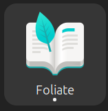

----------------------------------------------------------------

**Read e-books in style**

Discover a new chapter in reading with Foliate, the modern e-book reader tailored for GNOME. Immerse yourself in a distraction-free interface, with customization features designed to match your unique preferences.

Features include:

- Open EPUB, Mobipocket, Kindle, FB2, CBZ, and PDF files
- Paginated mode and scrolled mode
- Customize font and line-spacing
- Light, sepia, dark, and invert mode
- Reading progress slider with chapter marks
- Bookmarks and annotations
- Find in book
- Quick dictionary lookup

----------------------------------------------------------------

Technical education is changing. When I got into network engineering back in 1999 you almost had to take an instructor led class at an organization like New Horizons or a local community college.

But the Internet has changed that. I haven't taken an instructor led course in years. I do a lot of webinars and YouTube videos. I also buy ebooks from [Packt Publising](https://www.packtpub.com/en-us), [No Starch Press](https://nostarch.com/), and [Gumroad](https://gumroad.com). Even though Amazon makes $billions with its AWS service running 100% on Linux, they do not offer a Kindle app for Linux. Foliate solves that problem and is a great tool for organizing and reading ebooks.

----------------------------------------------------------------

**Installation Instructions**

```bash
flatpak install flathub com.github.johnfactotum.Foliate
```

Once installed, run  `Meld` from the terminal using:

```bash
flatpak run com.github.johnfactotum.Foliate
```

Or by tapping the `Super` key, typing `foliate` and clicking on the `Foliate` icon.

----------------------------------------------------------------
Here is a screenshot of Foliate with my Python Library:

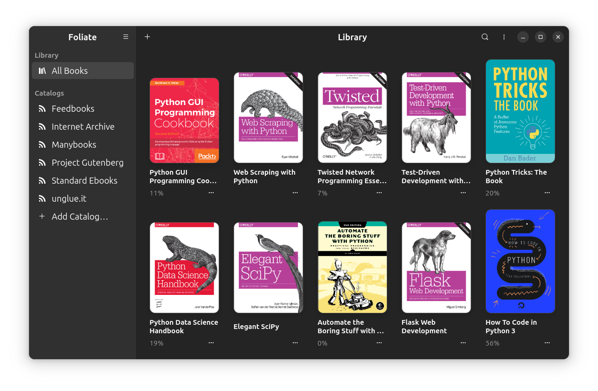

----------------------------------------------------------------

Foliate has a lot of functionality. So far I have just used it for reading the ebooks that I have purchased.

----------------------------------------------------------------

### KolourPaint


----------------------------------------------------------------

**Paint Program**

KolourPaint is a simple painting program to quickly create raster images. It is useful as a touch-up tool and simple image editing tasks. I use it to add callouts to screenshots.

Features:

- Support for drawing various shapes
  - lines
  - rectangles
  - rounded rectangles
  - ovals and polygons
  - curves
  - text
- Color picker
- Selections
- Rotation, monochrome and other advanced effects

----------------------------------------------------------------

**Installation Instructions**

```bash
flatpak install flathub org.kde.kolourpaint
```

Once installed, run  `KolourPaint` from the terminal using:

```bash
flatpak run org.kde.kolourpaint
```

Or by tapping the `Super` key, typing `KolourPaint` and clicking on the `KolourPaint` icon.

[The KolourPaint Handbook](https://docs.kde.org/stable5/en/kolourpaint/kolourpaint/index.html)

----------------------------------------------------------------

### Meld

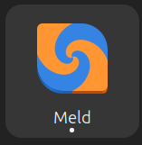

----------------------------------------------------------------

Meld is a flatpak from the Gnome project.

**Compare and merge your files**

Meld is a visual diff and merge tool targeted at developers. Meld helps you compare files, directories, and version controlled projects. It provides two- and three-way comparison of both files and directories, and supports many version control systems including Git, Mercurial, Bazaar and Subversion.

----------------------------------------------------------------

**Installation Instructions**

```bash
flatpak install flathub org.gnome.meld
```

Once installed, run  `Meld` from the terminal using:

```bash
flatpak run org.gnome.meld
```

Or by tapping the `Super` key, typing `meld` and clicking on the `Meld` icon.

----------------------------------------------------------------

#### Example

Here is an example of comparing two configuration files. On line 1 notice that there are two arrows int the center of the screen pointing at each other. Out of view in screenshot is the firmware version. The left and right have different versions. The differences are highlighted in blue blocks.

On line 2 you can see a blue highlight showing that the firmware on the left side is 14.01 and on the right it's 14.21.

On line 10 you see a green highlighted line on the right side with an arrow pointing to the left. That tells you that the line `sntp server priority 1 10.124.14.5` was added to the file on the right.

Further down you can see a blue highlighted line on the right that rolls over to the left. That tells you that the name of the interface was changed.

It takes a little bit of time to learn all the features of Meld but is is a great tool for a network engineer.

----------------------------------------------------------------

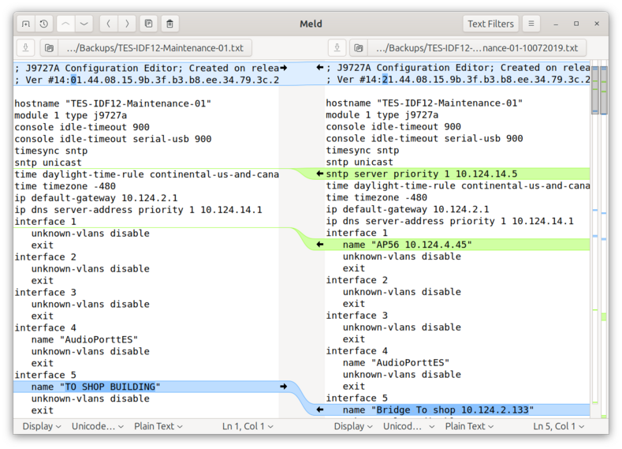

----------------------------------------------------------------

### Pinta

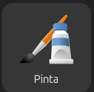

----------------------------------------------------------------

**Edit images and paint digitally**

Pinta is a image editing, drawing and painting application with a simple yet powerful interface. Pinta has a wide range of drawing tools, including: freehand, rectangles, circles and lines. It also has over 35 effects to apply to your images, and also has the ability to create unlimited layers to help organize your creativity.

We installed KolourPaint earlier and it works as expected but Pinta has a lot more features if I'm doing more than annotating a screenshot.

----------------------------------------------------------------

**Installation Instructions**

```bash
flatpak install flathub com.github.PintaProject.Pinta
```

Once installed, run  `Pinta` from the terminal using:

```bash
flatpak run com.github.PintaProject.Pinta
```

Or by tapping the `Super` key, typing `Pinta` and clicking on the `Pinta` icon.

----------------------------------------------------------------

### Resources

 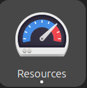

Gnome Resources is similar to the Windows Task Manager. Here is a [link](https://apps.gnome.org/Resources/) to the homepage describing Gnome Resources.

----------------------------------------------------------------

**Installation Instructions**

```bash
flatpak install flathub net.nokyan.Resources
```

Once installed, run `Resources` from the terminal using:

```bash
flatpak run net.nokyan.Resources
```

Or by tapping the `Super` key, typing resource and clicking on the Resources icon.

Here is a screenshot of the Processes tab. Just like in the Windows Task Manager, you can right click on a process and get a menu of actions to perform:

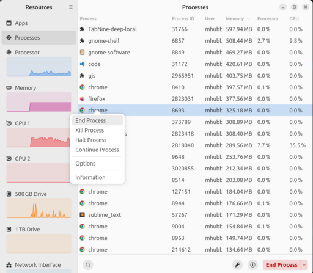

Unlike the Windows Task Manager, you have a clean menu on the side where you can select the following resources:

- Apps - the apps that are running
- Processes - the processes that are running
- Processor - The CPU AND GPU percentages
- Memory - The amount of memory applications are using
- GPU1 - The utilization of GPU1
- GPU2 - The utilization of GPU2
- Disk activity - Activity of each internal disk
- Network - Ethernet utilization
- WiFI - Utilization of the WiFI adapter
- Battery - Battery usage and properties

#### SAR

Linux has been around for over 30 years and is used on a lot of servers. That means that there are a lot of monitoring tools available. If you want to collect long term data on your laptop or have a server in your home lab you can use System Activity Report (SAR) to collect long term data.

There is a graphical interface available called KSAR that presents the data in a nice GUI. It's beyond the scope of this article to cover SAR/KSAR but here are link to some details blogs:

- [Using sar to Show Current and Past System’s Statistics](https://www.baeldung.com/linux/sar-system-statistics) - Baeldung.com is a great site for indepth Linux sysadmin articles.
- [KSAR](https://github.com/vlsi/ksar) - KSAR is a Java implementation of the GUI for SAR. I'm not big on Java tools but KSAR seems to be well maintained.

----------------------------------------------------------------

### Warehouse

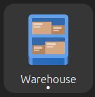

----------------------------------------------------------------

Ok, one more application for managing Flatpaks! Warehouse is relatively new and I had already been using `Gnome Extensions` and `Extension Manager` for flatpaks when I found this application. It can do everything in one place including adding non Flathub.org repositories. I haven't gone down that rabbit hole yet because I am happy spending time in the terminal if I'm not in VS Code.

**Manage all things Flatpak**

Warehouse provides a simple UI to control complex Flatpak options, all without resorting to the command line.

Features:

- Manage installed Flatpaks and view properties of any package
- Change versions of a Flatpak to rollback any unwanted updates
- Pin runtimes and mask Flatpaks
- Filter packages and sort data, to help find anything easily
- See current app user data, and cleanup any unused data left behind
- Add popular Flatpak remotes with a few clicks or add custom remotes instead
- Take snapshots of your apps' user data, saving your data
- Install new packages from any remote, or from your system
- Responsive UI to fit large and small screen sizes

----------------------------------------------------------------

**Installation Instructions**

```bash
flatpak install flathub io.github.flattool.Warehouse
```

Once installed, run  `Warehouse` from the terminal using:

```bash
flatpak run io.github.flattool.Warehouse
```

Or by tapping the `Super` key, typing `warehouse` and clicking on the `Warehouse` icon.

----------------------------------------------------------------

One great feature of `Warehouse` is that you can see how much disk space each application uses.

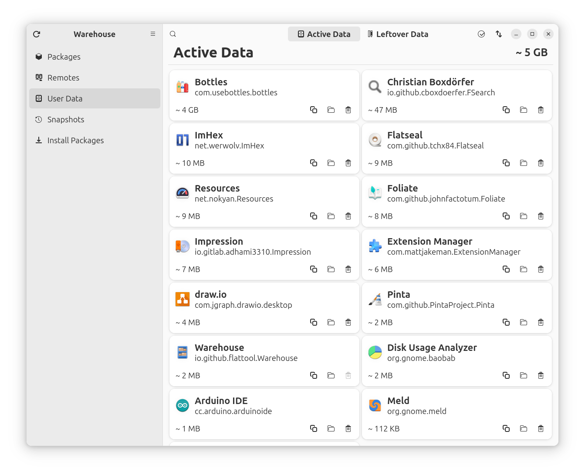

----------------------------------------------------------------

## Wrapping up

We installed several Gnome extensions that add functionality to the Gnome Desktop. Then we installed a few GUI applications that are useful in day to day operations. With these tools installed, I hope you find Ubuntu with Gnome desktop easy to manage and highly capable. In the next chapter we setup the terminal for complete awesomeness! You will wonder how you ever lived with cmd.exe!
