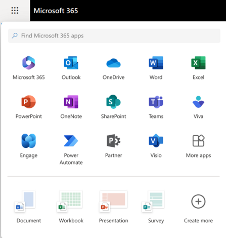
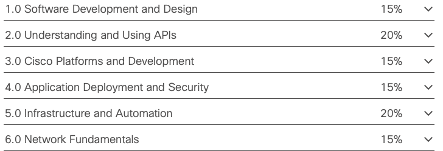

# Introduction

----------------------------------------------------------------

:arrow_forward: KEY TAKEAWAYS

- Ubuntu is **F**ree, **O**pen **S**ource **S**oftware - FOSS!
- Ubuntu is published by Canonical, a private company with an estimated $175M in annual revenues
- Canonical Support, called Ubuntu Pro, is free for 5 personal devices
- Ubuntu Pro is enterprise class support similar to the Microsoft Enterprise Agreement
- Ubuntu has [many flavors](https://wiki.ubuntu.com/UbuntuFlavors) and [dozens of specialized derivatives.](https://wiki.ubuntu.com/DerivativeTeam/Derivatives)
- Ubuntu will run on Intel/AMD x64 processors and many ARM processors such as Raspberry Pi, Odroid, etc.
- Ubuntu works great on VMware Workstation/Fusion, KVM, VirtualBox, and Gnome Boxes
- You can run almost all of the tools and applications in this guide on Windows 11 using WSL. There are tons of blogs and YouTube videos on installing WLS2 and Ubuntu.

----------------------------------------------------------------

**Ubuntu Today**

From Ubuntu's website, the first official Ubuntu release — Version 4.10, codenamed the ‘Warty Warthog’ — was launched in October 2004, and sparked dramatic global interest as thousands of free software enthusiasts and experts joined the Ubuntu community.

The Ubuntu desktop is by far the world’s most widely used Linux workstation platform, powering the work of engineers across the globe. Ubuntu Core sets the standard for tiny, transactional operating systems for highly secure connected devices. Ubuntu Server is the reference operating system for the OpenStack project, and a hugely popular guest OS on AWS, Azure and Google Cloud. Ubuntu is pre-installed on computers from Dell, HP, Asus, Lenovo and other global vendors.

----------------------------------------------------------------

## Who is this guide written for?

Any technical user running Microsoft Windows 10/11 who wants to try Linux! I used MS Windows from Windows 3.1 up until Windows 8 came out. At that time I had been using Linux for things like [Nagios](https://www.nagios.org/downloads/nagios-core/) and the Asterisk VoIP system, but not on my laptop. Windows 8 convinced me to try macOS and Ubuntu!

Once I started working with Python and studying for the Cisco NetDevOps certification, it became clear that Linux is a better choice for a technical user, whether they are a network engineer, administrator or developer. Tools like nmap work better under Linux ([raw socket support](https://antonio-cooler.gitbook.io/coolervoid-tavern/port-knocking-from-the-scratch)), you have access to sophisticated [terminal emulators](https://itsfoss.com/linux-terminal-emulators/) like Terminator, Alacritty, Tilix, and different shells (what most people call "the Terminal"). This guide will show you how to switch the shell from BASH to ZSH in a later chapter.

- **Network Engineers** can use this guide to get started with Linux and then to customize their daily driver to fit the unique needs of a network engineer.
- **Network Administrators** will find Unix tools like grep, sed, awk, and arp-scan useful in their day to day operation. This guide discusses these tools in [Working in the Terminal](https://github.com/rikosintie/Ubuntu4NetworkEngineers/blob/main/docs/terminal.md).
- **Security Personnel** will find a plethora of open source tools available for Linux. Many of these tools are discussed in the DNS chapter and in the networking tools chapter.
- **A Curious student** who wants to learn about Linux, Open Source, and NetDevOps.

This guide is written assuming that you have skills in MS Windows, Putty, Network devices, and a desire to learn how Linux can make you a better, more efficient engineer.

----------------------------------------------------------------

## Why use Ubuntu?

I helped a college student who was studying data science switch to Ubuntu recently. Our conversations had all been over text. I had the chance to meet him in person a month or so later and I asked him if he stuck with Ubuntu. His response was an enthusiastic Yes!

I have been using Linux for quite a while, so his next comment caught me off guard. He said, "I love how there are no ads and nothing pops up in the start menu." There were more comments about how "clean" the Ubuntu interface is. I hadn't realized how intrusive ads are on the Windows 10/11 home edition.

### But I need Microsoft office

There's a joke in the Linux community that "Microsoft :heart: Linux". Back in the 1990s Steve Balmer said "Linux is a cancer that attaches itself in an intellectual property sense to everything it touches." Now Microsoft supports Linux with the WSL in Windows, Linux servers in Azure and other ways.

With Microsoft 365 it's not a problem to use Teams, Outlook, PowerPoint, Word, and Excel. All of the Microsoft Applications run in a browser. I use Edge when I’m using Microsoft applications, but they also work in Chrome. For my needs they are great.

Here is an image of the Microsoft 365 launcher in Linux:

----------------------------------------------------------------

----------------------------------------------------------------

I don't have a license for Visio, I use the web based tool [Excalidraw](excalidraw.com) to create network diagrams. It's not as full featured as Visio but I know three Solutions Architects that have switched because it works on any OS and customers don't need Visio Viewers. In the Tools section of the guide I will show you an Flatpak application called [Draw.io](/docs/CH02-Install-Tools.md#drawio) that doesn't need an Internet connection to work.

----------------------------------------------------------------

### LibreOffice

If you prefer a real application, LibreOffice is better than Microsoft office in my opinion. I have had zero issues sharing LibreOffice documents with Microsoft Office users. I loved Microsoft Office up until Office 2003, but not as much after that! I can say that I love LibreOffice! I create a lot of Avery labels for switch boxes and the mail merge between different LibreWriter and LibreCalc is much easier than in Word/Excel!

LibreOffice is a Free open source Software (FOSS) project and is included in the full install of Ubuntu. I have met a few of the LibreOffice team at the Southern California Linux Expo and they are a great group of Geeks! The project releases updates to LibreOffice on a regular basis.

----------------------------------------------------------------

### As a Network Engineer it Rocks

Network Engineering is moving to a [NetDevOps](https://developer.cisco.com/video/net-prog-basics/) model and away from the CLI. This means using Python, Ansible, Git and other DevOps tools. Ubuntu is the OS that Cisco recommends for the DevNet certifications. In fact, Cisco is so strong on Ubuntu that they released an Ubuntu image for the DevNet Expert course. There is no reason not to use it for learning Linux. It's available as an OVA for VMWare Workstation and a QCOW2 for Linux.

Download it here: [Cisco Certified DevNet Expert (v1.0) Equipment and Software List](https://learningnetwork.cisco.com/s/article/devnet-expert-equipment-and-software-list?t=1696124836669)

Here is an image from the Cisco DevNet Associate course. You can see the emphasis on coding and automation.

----------------------------------------------------------------

## Open source software and the community

Ubuntu is a Linux distribution published by Canonical in the UK. There are both desktop and server versions available on the [Canonical site](https://ubuntu.com/download). If you are using VMware ESXi in your home lab, I recommend downloading Ubuntu server and spinning up a VM. It's free and the best way to learn is to get some hands on time with it. I have Ubuntu server 24.04 running on ESXi and have various networking tools installed.

If you have VMware workstation, Virtualbox, or Gnome Boxes running on your laptop, you can download/install Ubuntu Desktop and test it out for free.

Ubuntu is [Open source software](https://opensource.org/osd/), meaning that the source code is available on the Canonical website. This concept might be difficult to understand if you're used to proprietary software like Microsoft Windows! You will hear Open source software called 'Free, Open Source Software' (FOSS) or Libre Software. In this case the 'free' refers to freedom, not zero cost. Some open source projects offer support agreements or other services that require payment.

What I love about Ubuntu is the "Open Source Software" community. It is a large community of developers, users, and engineers who love creating software, hardware, and sharing it. Some examples of Open Source Software include:

- FireFox
- MariaDB
- OpenSSH
- OpenSSL
- Apache
- Nmap
- KeePassXC
- Python

Just to name a few!

## Open Source In Cisco Products

From Cisco's [website](https://www.cisco.com/c/en/us/about/legal/open-source-documentation-responsive.html):
Cisco values the open source community as an essential resource and partner in innovation. Here you can find information on the open source used in Cisco products.

**Cisco is a Leader in Open Source Innovation**

Open source is changing the technology industry and Cisco is a dedicated partner in that innovation. Cisco has been participating in open source development for nearly 3 decades, including founding projects like OpenDaylight, FD.io, VPP, SNAS, and OpenH264, and contributing to projects like OPNFV, Kubernetes, OpenStack, Ansible, Chef, Puppet, Maven, and countless more.

Cisco uses many open-source tools, with extensive documentation available at the link above.

Why am I bringing this up? Because when I started using Linux I just saw it as a tool. But now that I am a few years in, I see that it is the foundation of modern society. Almost every switch, router, firewall, public web server, surveillance camera, and IoT device runs on Linux and uses Open Source software. Once you start using Open Source software you really feel like part of the community.

----------------------------------------------------------------

## NetDevOps Certifications

Cisco and Juniper both have certifications for NetDevOps. They both have a substantial amount of free training material available. I have a repository with information on each program. If you are interested in working on either certification, the repositories can be found here:

- [Cisco DevNetAssoc](https://github.com/rikosintie/DevNetAssoc)
- [Juniper DevOps](https://github.com/rikosintie/Juniper-DevOps)

----------------------------------------------------------------

## Linux Certifications

The [Linux Professional Institute](https://www.lpi.org/) (LPI) offers several different certifications if you are interested. Linux Essentials is a good place to start. It is more about the Open Source philosophy and the history of Linux than a deep technical certification. LPI has free certification materials on its site.

----------------------------------------------------------------

## Installing Ubuntu

This document is meant to get you up to speed with Ubuntu quickly. The first question is should I just spin up a virtual machine or use bare metal? I used Linux for a few years as a VM before I bought dedicated hardware.

The advantage of using a VM is that if you damage it or decide for any reason it’s not the right distribution you can just delete it and try another one. A drawback of using a VM is that you will have to manually map usb devices from the host to the VM. This isn't a big deal, it just makes troubleshooting USB devices a bit more complicated.

My suggestion, if you have never touched Linux, is to install Ubuntu as a VM and get some experience with it. You won’t have to spend any money, Ubuntu is free, although I usually donate $10 when I download it to install on a fresh machine, and you can run any of the tools in this book.

I have Ubuntu running on a System76 Gazelle from 2016 and a Dell G5 5587 laptop from 2018. I did this because I wanted to get my Linux certifications and I felt that I needed to be running Linux on my daily driver to learn. Using a VM can perform almost anything the bare metal can. However, when I encountered an issue,  I often just shut it down and returned to Windows rather than solving it. Running on bare metal removed the temptation to do that!

There are a lot of good tutorials on installing Ubuntu available on the Internet, so I am not going to cover it here. It is actually very easy, pretty much click, click, next, reboot! This Youtube video [How to Install Ubuntu 24.04 Desktop: Complete Beginner's Guide](https://www.youtube.com/watch?v=zE7OYNkuQ1w) is a great guide to installing Ubuntu 24.04.

The site [linux config](https://linuxconfig.org) has a lot of great Ubuntu tutorials. Here is a link to a several tutorials on installing/configuring 24.04 tools – [Install Ubuntu 24.04 tools](https://linuxconfig.org/page/2?s=How+to+install+Ubuntu+24.04). If you want to install Ubuntu 24.04 on bare metal, the Lenovo T480 or T490 are good choices. They can be found for under $300 on ebay in good condition and have hardware that is certified on Ubuntu. You can also use the Ubuntu [Search Ubuntu certified hardware](https://ubuntu.com/certified?q=&limit=20&category=Desktop&category=Laptop) site to verify that the hardware you want to use will be well-supported on Ubuntu.

### Ubuntu Release Types

Ubuntu is released on a regular cadence. There are two types of releases:

- LTS releases - Every two years on even years. So 22.04 is the long-term release from 2022. The current LTS is 24.04
- Interim Releases - Released in October and April. So 22.10, 23.04, and 23.10 are interim releases after the LTS 22.04.

The LTS releases are rock solid, but they don't get new features or the latest kernel versions. If you put Ubuntu on bare metal and use it as your daily driver, I recommend that you use an LTS release.

In this guide, I am going to document the tools that I found useful in the transition to Linux for network engineering tasks.

----------------------------------------------------------------
