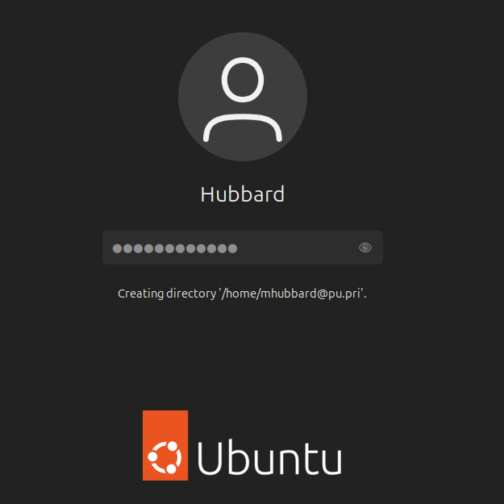
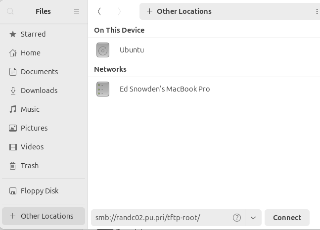
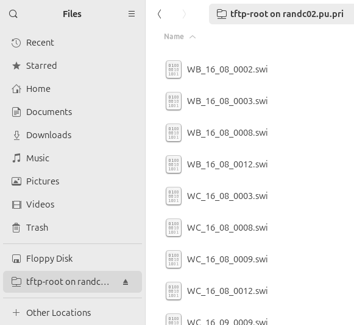
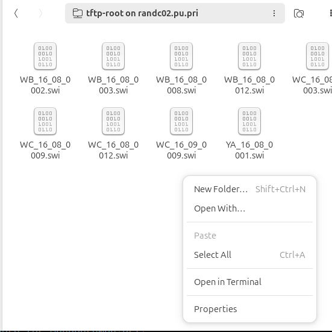

# Join Ubuntu 24.04 desktop to AD


----------------------------------------------------------------

:arrow_forward: KEY TAKEAWAYS

- It's surprising easy to join Ubuntu 24.04 to Active Directory
- All of the packages needed are in the Ubuntu package manager
- Ubuntu has several tools for managing the AD connection

----------------------------------------------------------------

Many companies will require that all laptops or Virtual Machines be connected to Active Directory. That is no problem with Ubuntu 24.04 as Canonical provides the packages needed.

## Install the packages needed to join AD

Whether it's a laptop or VM it should be fully updated before starting the installation of the Active Directory packages. Use the following command to update and install the packages:

```bash linenums='1'
sudo apt update && sudo apt upgrade
sudo apt install sssd-ad sssd-tools realmd adcli
```

### Review the installed packages

This is optional but I wanted to show you how to use `apt` to display versions

```text linenums='1' hl_lines='1 2 9 16 23'
mhubbard@z420VM-2404:~$ apt policy sssd-ad sssd-tools realmd adcli
sssd-ad:
  Installed: 2.9.4-1.1ubuntu6
  Candidate: 2.9.4-1.1ubuntu6
  Version table:
 *** 2.9.4-1.1ubuntu6 500
        500 http://us.archive.ubuntu.com/ubuntu noble/main amd64 Packages
        100 /var/lib/dpkg/status
sssd-tools:
  Installed: 2.9.4-1.1ubuntu6
  Candidate: 2.9.4-1.1ubuntu6
  Version table:
 *** 2.9.4-1.1ubuntu6 500
        500 http://us.archive.ubuntu.com/ubuntu noble/main amd64 Packages
        100 /var/lib/dpkg/status
realmd:
  Installed: 0.17.1-3build2
  Candidate: 0.17.1-3build2
  Version table:
 *** 0.17.1-3build2 500
        500 http://us.archive.ubuntu.com/ubuntu noble/main amd64 Packages
        100 /var/lib/dpkg/status
adcli:
  Installed: 0.9.2-1ubuntu2
  Candidate: 0.9.2-1ubuntu2
  Version table:
 *** 0.9.2-1ubuntu2 500
        500 http://us.archive.ubuntu.com/ubuntu noble/main amd64 Packages
        100 /var/lib/dpkg/status
```

### Prerequisites before joining AD

- A working Active Directory domain is available
- You have access to the credentials to join a machine to that domain
- The DC is acting as an authoritative DNS server for the domain.
- The primary DNS resolver on the laptop points to a DC (check with resolvectl status).
- System time is correct and in sync with the DC, maintained via a service like chrony or ntp.
- The domain used in this example is pu.pri.
- The laptop's hostname is z420VM-2404.

### Check the current host configuration

```text linenums='1' hl_lines='1 2'
mhubbard@z420VM-2404:~$ hostnamectl
 Static hostname: z420VM-2404.pu.pri
       Icon name: computer-vm
         Chassis: vm 🖴
      Machine ID: c7fecbdab8ed4fdba09c3833e51fc616
         Boot ID: e71c80c79fb54e2b9e88ea1c77e005a9
  Virtualization: vmware
Operating System: Ubuntu 24.04 LTS
          Kernel: Linux 6.8.0-31-generic
    Architecture: x86-64
 Hardware Vendor: VMware, Inc.
  Hardware Model: VMware Virtual Platform
Firmware Version: 6.00
   Firmware Date: Thu 2020-11-12
    Firmware Age: 3y 6month 2w 3d
```

Notice that the fully qualified DNS domain `pu.pri` is appended to the hostname. That is the domain we will join. For an Ubuntu 24.04 machine to join AD it must have the hostname setup correctly.

## If the host needs to have the FQDN configured

```bash
mhubbard@z420VM-2404:~$ sudo hostnamectl set-hostname z420VM-2404.pu.pri
mhubbard@z420VM-2404:~$ hostname
z420VM-2404.pu.pri
```

### Verify that a DC (192.168.10.222) is the DNS resolver

```text linenums='1' hl_lines='1 6 9 11'
mhubbard@z420VM-2404:~$ resolvectl status
Global
         Protocols: -LLMNR -mDNS -DNSOverTLS DNSSEC=no/unsupported
  resolv.conf mode: stub

Link 2 (ens33)
    Current Scopes: DNS
         Protocols: +DefaultRoute -LLMNR -mDNS -DNSOverTLS DNSSEC=no/unsupported
Current DNS Server: 192.168.10.222
       DNS Servers: 192.168.10.222
        DNS Domain: pu.pri
```

## Verify that the host can be found in DNS

The `host` command with a domain name as the parameter will return DNS information about the domain name.

```text linenums='1' hl_lines='1'
host pu.pri
pu.pri has address 192.168.10.222
pu.pri has IPv6 address fd24:42b2:12ce:0:a9da:b612:7d4c:7683
```

Now we know at there is a DC is at `192.168.10.222`.

The `host` command with a hostname will print out the hostname and ip address. Then we use the `host` command with the ip address to look up the host in DNS.

```text linenums='1' hl_lines='1 3'
mhubbard@z420VM-2404:~$ host z420VM-2404
z420VM-2404.pu.pri has address 192.168.10.105
mhubbard@z420VM-2404:~$ host 192.168.10.105
105.10.168.192.in-addr.arpa domain name pointer z420VM-2404.pu.pri.
```

The `host` command may return 127.0.1.1 as the ip address. This will still work in the second step. The host command returned the pu.pri domain so the host can be found in the DNS zone. There are two reasons I did it this way instead of just looking at the terminal prompt and pinging that name with the domain added on:

- You just learned about the host command. You can use `man host` to learn more.
- DNS is critical to AD and this method makes the DNS properties more obvious.

### Use dig to verify that DNS works

If the `host` command returns 127.0.1.1 as the ip address then use the `ip address` command to find the network ip address. In this example the `@` is used to pick a specific DNS server. If you don't use it the host will use the loopback IP address.

```text linenums='1' hl_lines='1 6 12 15'
mhubbard@z420VM-2404:~$ dig @192.168.10.222 -x 192.168.10.105

; <<>> DiG 9.18.28-0ubuntu0.24.04.1-Ubuntu <<>> @192.168.10.222 -x 192.168.10.105
; (1 server found)
;; global options: +cmd
;; Got answer:
;; ->>HEADER<<- opcode: QUERY, status: NOERROR, id: 24053
;; flags: qr aa rd ra; QUERY: 1, ANSWER: 1, AUTHORITY: 0, ADDITIONAL: 1

;; OPT PSEUDOSECTION:
; EDNS: version: 0, flags:; udp: 4000
;; QUESTION SECTION:
;105.10.168.192.in-addr.arpa.    IN    PTR

;; ANSWER SECTION:
105.10.168.192.in-addr.arpa. 3600 IN    PTR    z420VM-2404.pu.pri.

;; Query time: 0 msec
;; SERVER: 192.168.10.222#53(192.168.10.222) (UDP)
;; WHEN: Thu Aug 15 17:40:12 PDT 2024
;; MSG SIZE  rcvd: 88

```

You can also use grep to just pull out the hostname section:

```text linenums='1' hl_lines='1'
dig @192.168.10.222 -x 192.168.10.105 | grep -B 2 z420

;; ANSWER SECTION:
105.10.168.192.in-addr.arpa. 3600 IN    PTR    z420VM-2404.pu.pri.
```

## Use dig with the hostname

```text linenums='1' hl_lines='1 6 12 15'
mhubbard@z420VM-2404:~$ dig @192.168.10.222 z420VM-2404.pu.pri

; <<>> DiG 9.18.28-0ubuntu0.24.04.1-Ubuntu <<>> @192.168.10.222 z420VM-2404.pu.pri
; (1 server found)
;; global options: +cmd
;; Got answer:
;; ->>HEADER<<- opcode: QUERY, status: NOERROR, id: 3444
;; flags: qr aa rd ra; QUERY: 1, ANSWER: 1, AUTHORITY: 0, ADDITIONAL: 1

;; OPT PSEUDOSECTION:
; EDNS: version: 0, flags:; udp: 4000
;; QUESTION SECTION:
;z420VM-2404.pu.pri.            IN    A

;; ANSWER SECTION:
z420VM-2404.pu.pri.    3600     IN    A    192.168.10.105

;; Query time: 0 msec
;; SERVER: 192.168.10.222#53(192.168.10.222) (UDP)
;; WHEN: Thu Aug 15 17:45:48 PDT 2024
;; MSG SIZE  rcvd: 63
```

### Troubleshooting If using DHCP

It's critical that the host got a dhcp assigned address and that DHCP registered a DNS A record. If the above fails you have to fix it before proceeding.

I setup Windows server DHCP to always register a DNS A record and created an AD account for it to use.

#### Release and renew the lease

Ubuntu 24.04 has transitioned a lot of networking services to networkd from network manager. Because of this dhclient isn't installed. Run the following commands to install it and release/renew the lease:

```bash linenums='1'
sudo apt install isc-dhcp-client
sudo dhclient -r ens33
sudo dhclient -v ens33
```

The `-r` releases and the dhclient with no options renews. The `-v` means verbose and I like to use it to get more detail.

### Troubleshooting If using static IP

There is no automatic way for the DNS server to register your laptop if you are using a static IP address. You will have to manually create the DNS entry. I highly recommend that you create the forward and reverse DNS entry.

### Display the NTP server

```bash
cat /etc/systemd/timesyncd.conf
```

If you see `#NTP` then you will need to edit the `/etc/systemd/timesyncd.conf` file.

```bash
sudo gnome-text-editor /etc/systemd/timesyncd.conf
```

Set the DC as the NTP server

```text linenums='1'
[Time]
NTP=192.168.10.222
FallbackNTP=time-b.nist.gov
```

### Restart the daemons

```bash
systemctl daemon-reload
```

Verify that the time on the DC matches the time on the Ubuntu box

On the DC

- Open a cmd window

```text linenums='1' hl_lines='1'
C:\Windows\system32>time
The current time is: 14:57:02.37
```

On the Ubuntu box

```text linenums='1' hl_lines='1 2 5 6 7'
mhubbard@z420VM-2404:~$ timedatectl status
               Local time: Thu 2024-05-30 14:58:08 PDT
           Universal time: Thu 2024-05-30 21:58:08 UTC
                 RTC time: Thu 2024-05-30 21:58:08
                Time zone: America/Los_Angeles (PDT, -0700)
System clock synchronized: yes
              NTP service: active
          RTC in local TZ: no
```

### Verify that the host can find AD

```text linenums='1' hl_lines='1 4 8 10'
mhubbard@z420VM-2404:~$ realm -v discover pu.pri
 * Resolving: _ldap._tcp.pu.pri
 * Performing LDAP DSE lookup on: 192.168.10.222
 * Successfully discovered: pu.pri
pu.pri
  type: kerberos
  realm-name: PU.PRI
  domain-name: pu.pri
  configured: no
  server-software: active-directory
  client-software: sssd
  required-package: sssd-tools
  required-package: sssd
  required-package: libnss-sss
  required-package: libpam-sss
  required-package: adcli
  required-package: samba-common-bin
```

### Create the Kerberos file

```bash linenums='1' hl_lines='1 3 8'
mhubbard@z420VM-2404:~$ sudo touch /etc/krb5.conf

mhubbard@z420VM-2404:~$ sudo gnome-text-editor /etc/krb5.conf
[libdefaults]
    default_realm = PU.PRI
    rdns = false

mhubbard@z420VM-2404:~$ sudo cat /etc/krb5.conf
[libdefaults]
    default_realm = PU.PRI
    rdns = false
```

### Verify that the DC is discoverable

```bash linenums='1' hl_lines='1 5 7'
mhubbard@z420VM-2404:~$ realm discover randc02.pu.pri
pu.pri
  type: kerberos
  realm-name: PU.PRI
  domain-name: pu.pri
  configured: no
  server-software: active-directory
  client-software: sssd
  required-package: sssd-tools
  required-package: sssd
  required-package: libnss-sss
  required-package: libpam-sss
  required-package: adcli
  required-package: samba-common-bin
```

### Join the Domain

```bash linenums='1' hl_lines='1 48 18'
mhubbard@z420VM-2404:~$ realm join randc02.pu.pri
Password for Administrator:

mhubbard@z420VM-2404:~$ realm discover randc02.pu.pri
pu.pri
  type: kerberos
  realm-name: PU.PRI
  domain-name: pu.pri
  configured: kerberos-member
  server-software: active-directory
  client-software: sssd
  required-package: sssd-tools
  required-package: sssd
  required-package: libnss-sss
  required-package: libpam-sss
  required-package: adcli
  required-package: samba-common-bin
  login-formats: %U@pu.pri
  login-policy: allow-realm-logins
```

### Display the sssd.conf file

```bash linenums='1' hl_lines='1 6 9 14 15 16 17 18 19 20 21 22 23'
mhubbard@z420VM-2404:~$ sudo ls -l /etc/sssd
total 8
drwxr-xr-x 2 root root 4096 Apr 16 02:55 conf.d
-rw------- 1 root root  414 May 30 15:57 sssd.conf

mhubbard@z420VM-2404:~$ sudo cat /etc/sssd/sssd.conf

[sssd]
domains = pu.pri
config_file_version = 2
services = nss, pam

[domain/pu.pri]
default_shell = /bin/bash
ad_server = randc02.pu.pri
krb5_store_password_if_offline = True
cache_credentials = True
krb5_realm = PU.PRI
realmd_tags = manages-system joined-with-adcli
id_provider = ad
fallback_homedir = /home/%u@%d
ad_domain = pu.pri
use_fully_qualified_names = True
ldap_id_mapping = True
access_provider = ad
```

Note:
Something very important to remember is that this file must have permissions 0600 and ownership root:root, or else SSSD won’t start!

Some key things from this config file:

- cache_credentials: This allows logins when the AD server is unreachable
- fallback_homedir: The home directory. By default, /home/<user>@<domain>. For example, the AD user john will have a home directory of /home/john@pu.pri.
- use_fully_qualified_names: Users will be of the form user@domain, not just user. This should only be changed if you are certain no other domains will ever join the AD forest, via one of the several possible trust relationships.

## Display the PAM configuration file

In Linux Pluggable Authentication Modules (PAM) are used to extend authentication to new services.

```bash linenums='1' hl_lines='1'
mhubbard@z420VM-2404:~$ sudo cat /etc/pam.d/common-session
#
# /etc/pam.d/common-session - session-related modules common to all services
#
# This file is included from other service-specific PAM config files,
# and should contain a list of modules that define tasks to be performed
# at the start and end of interactive sessions.
#
# As of pam 1.0.1-6, this file is managed by pam-auth-update by default.
# To take advantage of this, it is recommended that you configure any
# local modules either before or after the default block, and use
# pam-auth-update to manage selection of other modules.  See
# pam-auth-update(8) for details.

# here are the per-package modules (the "Primary" block)
session [default=1]         pam_permit.so
# here's the fallback if no module succeeds
session requisite           pam_deny.so
# prime the stack with a positive return value if there isn't one already;
# this avoids us returning an error just because nothing sets a success code
# since the modules above will each just jump around
session required            pam_permit.so
# The pam_umask module will set the umask according to the system default in
# /etc/login.defs and user settings, solving the problem of different
# umask settings with different shells, display managers, remote sessions etc.
# See "man pam_umask".
session optional            pam_umask.so
# and here are more per-package modules (the "Additional" block)
session required    pam_unix.so
session optional    pam_sss.so
session optional    pam_systemd.so
# end of pam-auth-update config
mhubbard@z420VM-2404:~$ sudo pam-auth-update --enable mkhomedir
mhubbard@z420VM-2404:~$ sudo cat /etc/pam.d/common-session
#
# /etc/pam.d/common-session - session-related modules common to all services
#
# This file is included from other service-specific PAM config files,
# and should contain a list of modules that define tasks to be performed
# at the start and end of interactive sessions.
#
# As of pam 1.0.1-6, this file is managed by pam-auth-update by default.
# To take advantage of this, it is recommended that you configure any
# local modules either before or after the default block, and use
# pam-auth-update to manage selection of other modules.  See
# pam-auth-update(8) for details.

# here are the per-package modules (the "Primary" block)
session [default=1]          pam_permit.so
# here's the fallback if no module succeeds
session requisite            pam_deny.so
# prime the stack with a positive return value if there isn't one already;
# this avoids us returning an error just because nothing sets a success code
# since the modules above will each just jump around
session required             pam_permit.so
# The pam_umask module will set the umask according to the system default in
# /etc/login.defs and user settings, solving the problem of different
# umask settings with different shells, display managers, remote sessions etc.
# See "man pam_umask".
session optional             pam_umask.so
# and here are more per-package modules (the "Additional" block)
session required    pam_unix.so
session optional    pam_sss.so
session optional    pam_systemd.so
session optional    pam_mkhomedir.so
# end of pam-auth-update config
```

### Display the realm

```bash linenums='1' hl_lines='1 4 6 7 15'
mhubbard@z420VM-2404:~$ realm list
pu.pri
  type: kerberos
  realm-name: PU.PRI
  domain-name: pu.pri
  configured: kerberos-member
  server-software: active-directory
  client-software: sssd
  required-package: sssd-tools
  required-package: sssd
  required-package: libnss-sss
  required-package: libpam-sss
  required-package: adcli
  required-package: samba-common-bin
  login-formats: %U@pu.pri
  login-policy: allow-realm-logins
```

### Display AD Status

```bash linenums='1' hl_lines='1 6 9 12'
mhubbard@z420VM-2404:~$ sudo sssctl domain-status pu.pri
Online status: Online

Active servers:
AD Global Catalog: not connected
AD Domain Controller: randc02.pu.pri

Discovered AD Global Catalog servers:
- randc02.pu.pri

Discovered AD Domain Controller servers:
- randc02.pu.pri
```

## Log into the domain

The format at the login screen is `username@domain`. In this example, my username is mhubbard and the domain is pu.pri so the login will be `mhubbard@pu.pri`. Remember that the password is the Active Directory password.

----------------------------------------------------------------



----------------------------------------------------------------

You will see a message that the /home/username@domain directory is being created. If we open a terminal and run:

```bash linenums='1' hl_lines='1'
ls -l /home/
total 12
drwxr-x--- 17 mhubbard        mhubbard            4096 Aug 15 21:57  mhubbard/
drwxr-x--- 16 mhubbard@pu.pri domain users@pu.pri 4096 Aug 16 13:28 'mhubbard@pu.pri'/
```

you can see the `mhubbard@pu.pri` home directory, the owner is `mhubbard@pu.pri`and group membership is `domain users@pu.pri`.

----------------------------------------------------------------

### Add the AD user to the sudoers group

If your company policy allows it you should add your new AD account to the sudoers group. Log in with your local account (Assuming it has sudo rights) and run the following command:

```bash linenums='1' hl_lines='1'
sudo usermod -aG sudo mhubbard@pu.pri
```

----------------------------------------------------------------

### Connect to a windows share

Ubuntu uses the SAMBA protocols to join and work with a Windows domain. Once the laptop is joined you can easily access Windows share resources. Open the `Files` application and click on `+ Other Locations` at the bottom of the left window. You will see a `connect to server` message and a `Connect` button.

Since we are using the SAMBA protocol, the address will start with `smb://` and then the server name (IP or FQDN) and a share name. In the image below I an connecting to the DC (randc02.pru.pri) and a share named `tftp-root`.



----------------------------------------------------------------

Click on `Connect` and the share will be mounted and files will open a new window with the share displayed:

----------------------------------------------------------------



----------------------------------------------------------------

If you want to work with the files in the terminal the easiest way is to right click in the share window and select `Open in Terminal`:

----------------------------------------------------------------



----------------------------------------------------------------

The path is gnarly!

```bash linenums='1' hl_lines='1'
/run/user/1242401104/gvfs/smb-share:server=randc02.pu.pri,share=tftp-root$ ls -l
total 225895
-rwx------ 1 mhubbard@pu.pri domain users@pu.pri 16979365 Aug 17 23:21 WB_16_08_0002.swi
-rwx------ 1 mhubbard@pu.pri domain users@pu.pri 16977864 Aug 17 23:21 WB_16_08_0003.swi
```

### Create a mount point

If you work mostly from the terminal it's probably better to create a mount point and mount the share:

```bash linenums='1' hl_lines='1 3 5 6'
sudo mkdir /mnt/tftp-root

sudo mount -t cifs -o username=mhubbard@pu.pri,password=Sup3rS3cr3t //192.168.10.222/tftp-root /mnt/tftp-root/

cd /mnt/tftp-root/
mhubbard@pu.pri@z420-2404:/mnt/tftp-root$ l -l
total 225912
-rwxr-xr-x 1 root root 16979365 Aug 17 23:21 WB_16_08_0002.swi*
-rwxr-xr-x 1 root root 16977864 Aug 17 23:21 WB_16_08_0003.swi*
```

Then when you are finished, unmount the shared filesystem:

```bash
sudo umount -l /mnt/tftp-root
```

The `-l` argument means lazy. It unmounts when all processes and dependencies are released.

----------------------------------------------------------------

### Display a specific user

```bash linenums='1' hl_lines='1 2 7 8 9 11'
sudo sssctl user-checks mhubbard@pu.pri
user: mhubbard@pu.pri
action: acct
service: system-auth

SSSD nss user lookup result:
 - user name: mhubbard@pu.pri
 - user id: 1242401104
 - group id: 1242400513
 - gecos: Hubbard, Michael
 - home directory: /home/mhubbard@pu.pri
 - shell: /bin/bash

SSSD InfoPipe user lookup result:
 - name: mhubbard@pu.pri
 - uidNumber: 1242401104
 - gidNumber: 1242400513
 - gecos: Hubbard, Michael
 - homeDirectory: not set
 - loginShell: not set

testing pam_acct_mgmt

pam_acct_mgmt: Permission denied

PAM Environment:
 - no env -
```

### Display the "Domain Users" group

```bash linenums='1' hl_lines='1'
mhubbard@z420VM-2404:~$ getent group "domain users"@pu.pri
domain users@pu.pri:*:1242400513:z420VM-2404@pu.pri
```

### Display a user's groups

```bash linenums='1' hl_lines='1'
groups mhubbard@pu.pri
mhubbard@pu.pri : domain users@pu.pri denied rodc password replication group@pu.pri cisco admins@pu.pri sonicwall-nps@pu.pri domain admins@pu.pri
```

### Display user information

```text linenums='1' hl_lines='1'
mhubbard@z420VM-2404:~$ getent passwd mhubbard@pu.pri
mhubbard@pu.pri:*:1242401104:1242400513:Hubbard, Michael:/home/mhubbard@pu.pri:/bin/bash
```

The values:

- User ID Number (uidNumber):   `1242401603`
- group ID Number (gidNumber):  `1242400513`
- User:                         `Hubbard, Michael`
- Home Directory:               `/home/mhubbard@pu.pri`
- Shell:                        `/bin/bash`

## References

- [How to set up SSSD with Active Directory](https://ubuntu.com/server/docs/how-to-set-up-sssd-with-active-directory)
- [Arch Wiki](https://wiki.archlinux.org/title/Systemd-resolved) - Configuring/troubleshooting systemd-resolved for DNS resolution.
- [How to Add a User to Sudoers in Ubuntu 24.04](https://linuxconfig.org/how-to-add-a-user-to-sudoers-in-ubuntu-24-04)
