# KVM Install


----------------------------------------------------------------

:arrow_forward: KEY TAKEAWAYS

- Ubuntu supports KVM virtualization on the desktop and server
- KVM supports NATed and bridged interfaces just like VMware Fusion or workstation.
- You create/manage KVM virtual machines with a GUI (virt-manager) or from the terminal (virsh commands)
- KVM is updated automatically by Ubuntu so there are never package mismatches with the kernel.

----------------------------------------------------------------

## Introduction

KVM is the Linux Kernel-mode Virtual Machine tool. It's free and easy to install on Ubuntu. With all the uncertainty around VMware workstation, it's worth knowing how to use KVM! Like everything else when switching to Linux, it will feel quite different than using VMware Workstation at first. But once you spend a couple days KVM and create a few virtual machines I think you will like it.

Plus, VMware is always way behind the Linux kernel so you have to resort to running the updates from [vmwware host modules](https://github.com/mkubecek/vmware-host-modules) after you update Ubuntu. It's an ugly situation.

By default KVM creates virtual machines on a NATed interface with a dhcp address in the range of 192.168.122.2-.254. The linux package dnsmasq is used to provide the DNS/DHCP services. NAT enables connected guests to use the host physical machine IP address for communication to any external network.

The `default` network interface is `virbr0` and using `ip address device show virbr0` looks like this:

```bash
ip address show device virbr0
20: virbr0: <NO-CARRIER,BROADCAST,MULTICAST,UP> mtu 1500 qdisc noqueue state DOWN group default qlen 1000
    link/ether 52:54:00:b5:48:b1 brd ff:ff:ff:ff:ff:ff
    inet 192.168.122.1/24 brd 192.168.122.255 scope global virbr0
       valid_lft forever preferred_lft forever
```

----------------------------------------------------------------

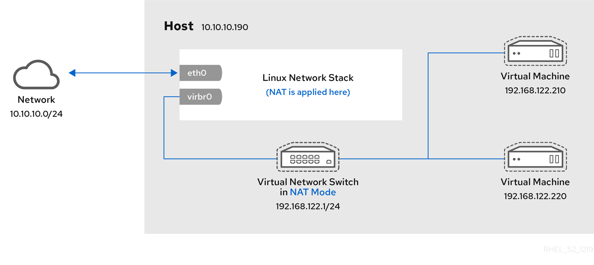

----------------------------------------------------------------

As with VMware, you can create a bridge interface so that the virtual machine has an ip address on the same network as the host. Creating a bridge interface is explained [below](#creating-a-kvm-bridge). A network engineer will probably need a bridge interface.

----------------------------------------------------------------

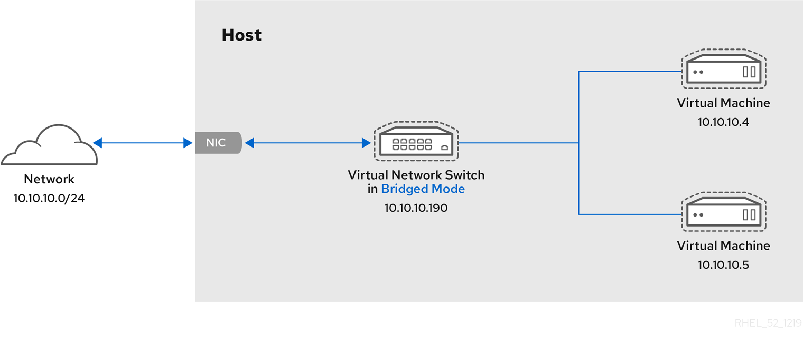

----------------------------------------------------------------

The two Redhat links in the [references](#reference-links) section have a lot of information on creating interfaces.

----------------------------------------------------------------

## Installing KVM

To run KVM, you must have virtualization enabled at the BIOS level. It can be a challenge to find virtualization in the BIOS because different manufacturers call it different things. The easiest way to find out what virtualization is called on your PC is to google your motherboard model.

### Verifying virtualization

Once you have enabled virtualization in the BIOS, you should verify that it is seen by the CPU.

### Using egrep

To verify that virtualization is enabled in BIOS, run:

```bash
egrep -c '(vmx|svm)' /proc/cpuinfo
```

48

This greps the /proc/cpuinfo file,  vmx is Intel, svm is AMD. You need to see a number in the output. In my case I have a 24 core Xeon processor that provides 48 cores of virtual CPUs.

### Install cpu-checker

```bash
sudo apt install cpu-checker -y
```

This is a optional package. From the Debian site:
"There are some CPU features that are filtered or disabled by system BIOSes. This set of tools seeks to help identify when certain features are in this state, based on kernel values, CPU flags and other conditions. Supported feature tests are NX/XD and VMX/SVM."

The tools is run using `kvm-ok` even though it's installed with `cpu-checker` for some reason. One advantage it has over grepping the /proc/cpuinfo file is that in some failure cases it will provide hints on what to do.

```bash linenums="1" hl_lines="1 10"
sudo kvm-ok
INFO: /dev/kvm exists
KVM acceleration can be used
```

from `man kvm-ok` page:

```text
DESCRIPTION
    kvm-ok is a program that will determine if the system
    can host hardware accelerated KVM virtual machines.

    The program will first determine if `/proc/cpuinfo`
    contains the flags indicating that the CPU has the
    Virtualization Technology (VT) capability.

    Next, it will check if the /dev/kvm device exists.

    If running as root, it will check your CPU's MSRs
    to see if VT is disabled in the BIOS.

    In some failure cases, kvm-ok provides hints on
    how you might go about enabling KVM on a system
    where it is arbitrarily disabled.

    If KVM can be used, this script will exit 0, otherwise it will exit non-zero.
```

### Use lscpu

lscpu is a built in tool to view cpu information. You can see on line 10 that the virtualization is VT-x:

```bash linenums="1" hl_lines="1 10"
lscpu | egrep -i 'Model name|Socket|Thread|NUMA|CPU\(s\)|virtual'
Address sizes:                        46 bits physical, 48 bits virtual
CPU(s):                               24
On-line CPU(s) list:                  0-23
Model name:                           Intel(R) Xeon(R) CPU E5-2697 v2 @ 2.70GHz
Thread(s) per core:                   2
Core(s) per socket:                   12
Socket(s):                            1
CPU(s) scaling MHz:                   48%
Virtualization:                       VT-x
NUMA node(s):                         1
NUMA node0 CPU(s):                    0-23
```

## Installing the packages for KVM

### Verify the Ubuntu Version

While  not technically necessary, you can verify the version of Ubuntu you have installed with:

```bash linenums="1" hl_lines="1"
cat /etc/os-release
───────┬────────────────────────────────────────────────────────────────────────────────
       │ File: /etc/os-release
───────┼────────────────────────────────────────────────────────────────────────────────
   1   │ PRETTY_NAME="Ubuntu 24.04 LTS"
   2   │ NAME="Ubuntu"
   3   │ VERSION_ID="24.04"
   4   │ VERSION="24.04 LTS (Noble Numbat)"
   5   │ VERSION_CODENAME=noble
   6   │ ID=ubuntu
   7   │ ID_LIKE=debian
   8   │ HOME_URL="https://www.ubuntu.com/"
   9   │ SUPPORT_URL="https://help.ubuntu.com/"
  10   │ BUG_REPORT_URL="https://bugs.launchpad.net/ubuntu/"
  11   │ PRI_POL_URL="https://www.ubuntu.com/terms-and-policies/privacy-policy"
  12   │ UBUNTU_CODENAME=noble
  13   │ LOGO=ubuntu-logo
───────┴────────────────────────────────────────────────────────────────────────────────
```

### Make sure Ubuntu is up to date

```bash
sudo apt update && sudo apt upgrade
```

### Install the packages

```bash linenums="1"
sudo apt install libvirt-daemon
sudo apt install virt-manager
sudo apt install qemu-kvm
sudo apt install virtinst
sudo apt install libvirt-clients
sudo apt install bridge-utils
```

or you can use this to install all at once:

```bash linenums="1"
sudo apt install libvirt-daemon virt-manager qemu-kvm virtinst libvirt-clients bridge-utils
```

I prefer to do one package at time so that I can watch each package but either works. All packages are about 200MB.

### Configure the groups

Your user has to be in the following groups

```bash linenums="1"
sudo usermod -aG kvm $USER
sudo usermod -aG libvirt $USER
```

### Verify the groups have your user

```bash linenums="1" hl_lines="1"
groups $USER
mhubbard : mhubbard adm cdrom sudo dip plugdev users kvm lpadmin libvirt wireshark
```

## Enable the virt daemon

```bash linenums="1"
sudo systemctl enable --now libvirtd
sudo systemctl start libvirtd
sudo systemctl status libvirtd
```

### If you make changes and need to restart the daemon

```bash
sudo systemctl restart libvirtd
```

### Where are the virt files stored

The qemu files are located in /etc/libvirt. You can list the files using:

```bash linenums="1" hl_lines="1"
ls -l /etc/libvirt
total 126K
drwxr-xr-x 2 root root    2 2024-05-06 06:12 hooks/
-rw-r--r-- 1 root root  450 2024-01-15 01:58 libvirt-admin.conf
-rw-r--r-- 1 root root  547 2024-01-15 01:58 libvirt.conf
-rw-r--r-- 1 root root  18K 2024-05-06 06:12 libvirtd.conf
-rw-r--r-- 1 root root 2.3K 2024-01-15 01:58 libxl.conf
-rw-r--r-- 1 root root 2.2K 2024-05-06 06:12 libxl-lockd.conf
-rw-r--r-- 1 root root 2.5K 2024-05-06 06:12 libxl-sanlock.conf
-rw-r--r-- 1 root root 1.2K 2024-01-15 01:58 lxc.conf
drwxr-xr-x 2 root root   26 2024-05-07 19:47 nwfilter/
drwxr-xr-x 4 root root    8 2024-08-02 16:44 qemu/
-rw------- 1 root root  38K 2024-05-20 16:17 qemu.conf
-rw------- 1 root root  38K 2024-05-20 16:15 qemu.conf.bak
-rw-r--r-- 1 root root 2.2K 2024-05-06 06:12 qemu-lockd.conf
-rw-r--r-- 1 root root 2.5K 2024-05-06 06:12 qemu-sanlock.conf
drwx------ 2 root root    2 2024-05-07 19:47 secrets/
drwxr-xr-x 3 root root    5 2024-05-08 21:36 storage/
-rw-r--r-- 1 root root 3.0K 2024-01-15 01:58 virtlockd.conf
-rw-r--r-- 1 root root 4.0K 2024-01-15 01:58 virtlogd.conf
```

### Back up qemu.conf

If you want to make any changes to the qemu.conf file I recommend making a backup first using:

```bash
sudo cp /etc/libvirt/qemu.conf /etc/libvirt/qemu.conf.bak
```

Run the following to show the backup:

```bash linenums="1" hl_lines="1"
sudo ls -l /etc/libvirt/qemu.conf*
-rw------- 1 root root 38439 May 20 16:17 /etc/libvirt/qemu.conf
-rw------- 1 root root 38407 May 20 16:15 /etc/libvirt/qemu.conf.bak
```

To list the qemu.conf file:

```bash
sudo cat etc/libvirt/qemu.conf
```

To edit the qemu.conf file:

```bash
sudo gnome-text-editor /etc/libvirt/qemu.conf
```

I didn't need to change the qemu.conf file for anything in this post. It's unlikely that you will need to but I wanted to show how to backup a file in the /etc/ directory.

----------------------------------------------------------------

## Creating a KVM Bridge

Why do I need create a bridge?

**From the Tecmint link in the reference section below**

A typical use case of software network bridging is in a virtualization environment to connect virtual machines (VMs) directly to the host server network. This way, the VMs are deployed on the same subnet as the host and can access services such as DHCP and much more.

See the link [Introduction to Linux interfaces for virtual networking](https://developers.redhat.com/blog/2018/10/22/introduction-to-linux-interfaces-for-virtual-networking) for a detailed tutorial on all the virtual interfaces that Linux supports. The list is impressive!

If you just need a virtual machine that is isolated on the host you can use the NAT interface that is built into KVM. Each guest will get an IP address in the range `192.16810.2 - 192.168.10.254`.

If you need a static address on the default network see [KVM libvirt assign static guest IP addresses using DHCP on the virtual machine](https://www.cyberciti.biz/faq/linux-kvm-libvirt-dnsmasq-dhcp-static-ip-address-configuration-for-guest-os/)

### The LAN Information

- LAN Network 192.168.10.0/24
- Ubuntu workstation NIC - `eno1`

### Install the bridge-utils package

If you installed the `bridge-utils` package earlier you can skip this step.

`sudo apt-get install bridge-utils`

If you can't remember just run the command again. APT will tell you that the latest version is installed and exit.

### Create the Netplan yaml file

- `sudo touch etc/netplan/01-netcfg.yaml`
- `sudo gnome-text-editor /etc/netplan/01-netcfg.yaml`
- Paste the following into the yaml file. Change IP addresses and interfaces to match your machine.

```YAML title='/etc/netplan/01-netcfg.yaml' linenums='1'
# This file describes the network interfaces available on your system
# For more information, see netplan(5).
network:
  version: 2
  renderer: networkd
  ethernets:
      eno1:
          addresses:
              - 192.168.10.235/24

  bridges:
    br0:
      interfaces: [ eno1 ]
      dhcp4: false
      addresses: [192.168.10.250/24]
      routes:
      - to: default
        via: 192.168.10.253
        metric: 100
        on-link: true
      nameservers:
        addresses: [1.1.1.1]
      dhcp6: yes
      link-local: [ ]
      parameters:
        stp: true
        forward-delay: 4
```

Save the file, then change the permissions

`sudo chmod 600 etc/netplan/01-netcfg.yaml`

### Activate the bridge

You can use `sudo netplan try` to test the changes to 01-netcfg.yaml. If there are no errors just press `enter` to accept the changes.

Yaml is a pain to work with. You will probably have some errors in the beginning!

If you are sure that the yaml is correct you can use:

`sudo netplan apply`

to activate the file without testing. I recommend using `sudo netplan try` all the time.

This creates a bridge named br0 mastered to eno1.

Use `ip a` to view the interfaces:

`eno1: <BROADCAST,MULTICAST,UP,LOWER_UP> mtu 1500 qdisc pfifo_fast master br0 state UP group default qlen 1000`

`br0: <BROADCAST,MULTICAST,UP,LOWER_UP> mtu 1500 qdisc noqueue state UP group default qlen 1000
    link/ether e6:b5:f8:a0:9b:c5 brd ff:ff:ff:ff:ff:ff
    inet 192.168.10.250/24 brd 192.168.10.255 scope global noprefixroute br0
       valid_lft forever preferred_lft forever`

### Display the bridge

```c# linenums="1" hl_lines="1"
sudo brctl show
bridge name bridge id          STP enabled  interfaces
br0         8000.e6b5f8a09bc5  yes          eno1
                                            vnet3
                                            vnet5
```

### Display the netplan configuration

The following displays the system wide network configuration

`sudo netplan get`

### Ping the hosts on the bridge

The Window server is at 192.168.10.231 and the Windows 10 guest is at 192.168.10.232

```c# linenums="1" hl_lines="2 8"
┌─[mhubbard@HP-Z420] - [~] - [375]
└─[$] ping 192.168.10.231
PING 192.168.10.231 (192.168.10.231) 56(84) bytes of data.
64 bytes from 192.168.10.231: icmp_seq=1 ttl=128 time=0.358 ms
64 bytes from 192.168.10.231: icmp_seq=2 ttl=128 time=0.390 ms

┌─[mhubbard@HP-Z420] - [~] - [376]
└─[$] ping 192.168.10.232
PING 192.168.10.232 (192.168.10.232) 56(84) bytes of data.
64 bytes from 192.168.10.232: icmp_seq=1 ttl=128 time=0.657 ms
```

### list out the xml config files

`l -la /etc/libvirt/qemu/networks`

### Verify the physical network switchport settings

Make sure that the switchport of the physical network switch doesn't have bpdu-guard enabled! Once the bridge comes up it sends bpdu frames.

I was connected to a Cisco 3850 on an access port. The switch had `spanning-tree portfast bpduguard default` in global configuration. The port went into err-disabled when the bridge came up. It took me a while  to figure out why the bridge wasn't working!

I changed the port to a trunk with native vlan 10 to match the configuration that had been on the access port.

```c# linenums="1"
interface GigabitEthernet1/0/6
 description < HP z420 >
 switchport access vlan 10
 switchport trunk native vlan 10
 switchport mode trunk
 storm-control broadcast level 1.00 0.50
 storm-control multicast level 1.00 0.50
end
```

## Virsh Commands

### View saved configuration

- `virsh dumpxml win2k16 | grep -i 'bridge'` show bridge config for a host named win2k16
- `virsh dumpxml win2k16 > ~/win2k16.xml` Save the configuration for a host named win2k16

### Start/stop a virtual machine

- `sudo virsh win2k16 start` Start a virtual machine named win2k16
- `sudo virsh shutdown win2k16` Send an ACPI shutdown signal to the virtual machine
- `sudo virsh destroy win2k16` Power off the VM without signalling it. Data loss can occur
- `sudo virsh reboot` win2k16 Does not signal the VM. Data loss can occur

### View VM Details

- `virsh dominfo win2k16` Show detailed information

### Check Virtual Machine status

- `virsh domstate win2k16`

### List virtual machines

- `virsh list --all` List all vms including those not running
- `virsh list` List all running vms

### Connect to VM Console

- `sudo virsh console win2k16` See [How to enable KVM virsh console access]([#how-to-enable-kvm-virsh-console-access](https://ravada.readthedocs.io/en/latest/docs/config_console.html)) for a detailed article on how to setup console access

### View DHCP leases

- `virsh net-dhcp-leases default` show dhcp leases on network default.
- `virsh net-dhcp-leases host-bridge` show dhcp leases on network host-bridge.

In the yaml file we disabled dhcp with `dhcp4: false` so there are no leases.

### View the network yaml files

- virsh netdumpxml default Show the configuration of the network named default
- virsh netdumpxml host-bridge Show the configuration of the network named host-bridge

### Edit the network yaml files

- virsh net-edit default Open the yaml configuration file of the  network `default` in the system editor
- virsh net-edit host-bridge Open the yaml configuration file of the network `host-bridge` in the system editor

### Start/Stop networks

- virsh net-destroy default Stop the network `default`
- virsh net-start default Start the network `default`

## Manually create the bridge configuration

You can manually create the bridge and link it to eno1 from the terminal

```c# linenums="1"
sudo ip link add name br0 type bridge
sudo ip link set eno1 master br0
sudo ip address add 192.168.10.250/16 brd 192.168.10.255
```

This method will not survive a reboot but it's quick for testing.

----------------------------------------------------------------

## Create a Windows 10 virtual machine

Linux can't ship Windows drivers so you have to download the `virtio` package first. The Fedora People host the ISO [here](https://fedorapeople.org/groups/virt/virtio-win/direct-downloads/stable-virtio/virtio-win.iso). Save it to your `Downloads` directory.

You do not need the virtio ISO if you are creating a Linux virtual machine.

You will need the Windows ISO also. You can download it using this link - [Windows 10 2023 Update | Version 22H2](https://www.microsoft.com/en-us/software-download/windows10ISO)

Open the terminal and enter:

```bash
virt-manager
```

Or hit the super key and type `virt` to bring up the virtual machine icon.

This will open the virt-manager GUI.

Click on the "New Virtual Machine" Icon.

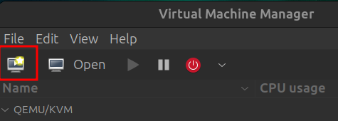

Select "local install media (ISO image or CD-ROM)" and click forward.

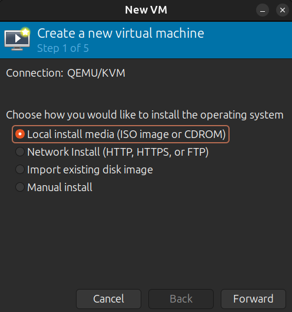

On this screen click "Browse" and select the Windows ISO and click "Forward". Notice that KVM identifies the ISO as Windows 11.


Set the Memory and CPU sizes, click forward

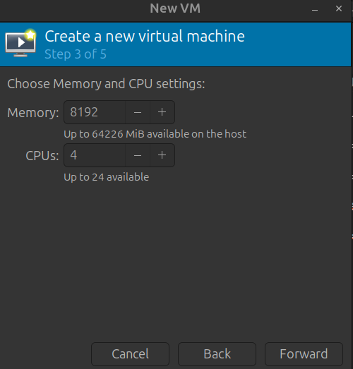

Set the disk size. Since this is a throw away virtual machine I set it to 20GB.

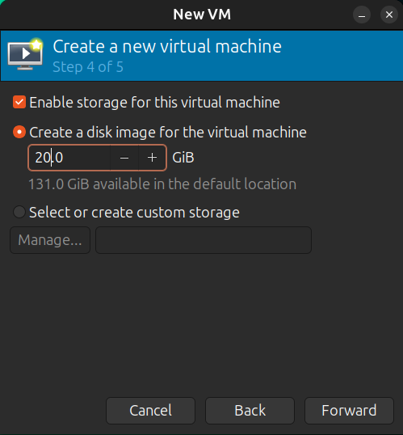

Click on "Select or create custom storage". Click "Manage..." and select the virtio ISO that you downloaded earlier.


Click Forward, this is the "ready to begin installation" dialog. Click "Customize before install".

Click forward and select the NIC


!!! note

    You must follow the [Creating a KVM Bridge](#creating-a-kvm-bridge) section first. If you just need a NAT virtual machine, you don't need to create a bridge. But you won't be able to remote desktop into the Windows virtual machine.

If you need a bridge, leave the NIC at NAT, finish creating the virtual machine, follow the instructions for creating a bridge, then go back and change the NIC to Bridge/Br0 using the Edit, Virtual Machine Details menu.

Click finish and the GUI based installation of Windows will begin. It's different than a Windows install on bare metal and you will see an image of the virtio drivers installing before the windows installation starts.

## Start the virtual machine

From the terminal you can open the Virtual Machine's GUI console using

`virt-viewer`

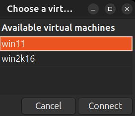

Select the Win11 virtual machine anc click connect.

The GUI console will open:

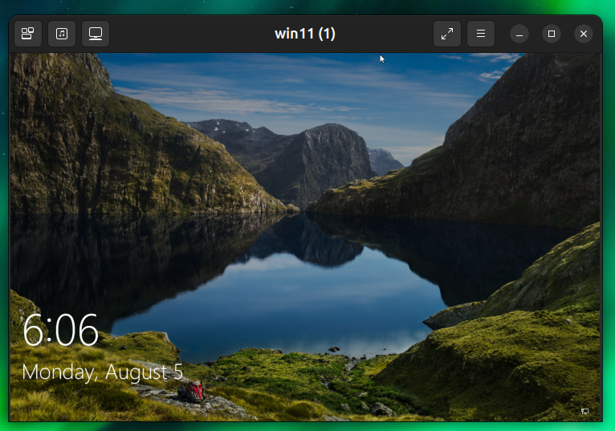

Click the icon on the top left and select `Ctrl+Alt+Delete`.

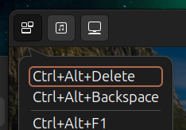

:arrow_right:  The VM says it's Windows 11 but it is actually Windows 10!


Congratulations, you now have a bridged Windows virtual machine up and running on Linux with KVM!

----------------------------------------------------------------

## Install the qemu guest-agent

The qemu-guest-agent is a helper daemon installed in a virtual machine (guest) when using QEMU. It is used to exchange information between the host and guest, and can be used to properly shut down the guest. The agent passes network information, including IP addresses, from the virtual machine to the host.

### Mount the ISO image

We need to mount the virtio-win-<version>.iso image on the host

**On the Linux host**

Open a terminal and run these commands:

```bash linenums='1'
cd /media
sudo mkdir iso
sudo mount -o loop ~/Downloads/virtio-win-0.1.240.iso /media/iso
mount: /media/iso: WARNING: source write-protected, mounted read-only.
```

Now the iso is mounted at /media/iso. It's read only but that's fine. We are not going to change anything.

Now change to the iso directory and list the files:

```bash linenums='1' hl_lines='1 2'
cd iso
ls -l
total 45M
dr-xr-xr-x 13 root root 2.0K 2023-09-18 23:17 amd64/
dr-xr-xr-x 16 root root 2.0K 2023-09-18 23:17 Balloon/
dr-xr-xr-x  2 root root 2.0K 2023-09-18 23:17 cert/
dr-xr-xr-x  2 root root 2.0K 2023-09-18 23:17 data/
dr-xr-xr-x 11 root root 2.0K 2023-09-18 23:17 fwcfg/
dr-xr-xr-x  2 root root 2.0K 2023-09-18 23:18 guest-agent/
...
```

The file that we will be installing is in the guest-agent folder, qemu-ga-x86_64.msi.

```bash linenums='1' hl_lines='1 4'
cd guest-agent

/media/iso/guest-agent
$ ls -l
total 20M
-r--r--r-- 1 root root 9.6M 2023-07-10 23:17 qemu-ga-i386.msi
-r--r--r-- 1 root root 9.7M 2023-07-10 23:17 qemu-ga-x86_64.msi
```

### Mount the iso on the Windows guest

Switch to `virt-manager` and open a console to the Windows host. Above the console, click the `Virtual Machine` menu and select `Redirect USB device`:

----------------------------------------------------------------

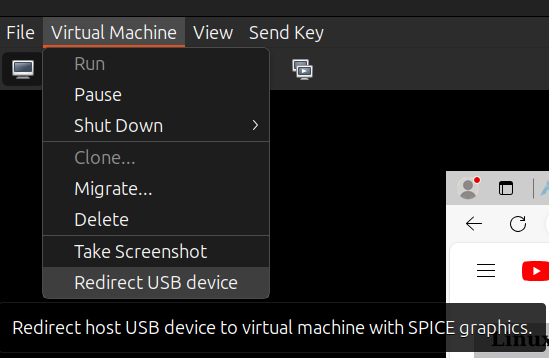

----------------------------------------------------------------

A dialog will open, select the `Generic Mass Storage` device.

----------------------------------------------------------------

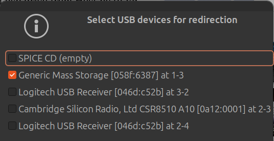

----------------------------------------------------------------

### Install the Guest Agent

In the guest, open file Explorer and select the iso.

Double click on the guest-agent directory, then double click on `qemu-ga-x86_64.msi`. This is a standard Windows MSI installer, follow the directions and finish the install.

### Verify that the guest agent is running on Windows

Open a PowerShell console

```bash linenums='1' hl_lines='1'
PS C:\Users\mhubbard> Get-Service QEMU-GA

Status   Name               DisplayName
------   ----               -----------
Running  QEMU-GA            QEMU Guest Agent
```

You will now be able to copy/paste between the guest/host and host/guest.

### Clean up

Now that the agent is installed, we need to eject the ISO from the guest and unmount the ISO from the host. In Files Explorer, right click over the DVD Drive: virtio-win-0.1.240 and select the `eject` option.

----------------------------------------------------------------

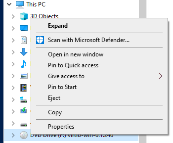

----------------------------------------------------------------

On the host, open a terminal (you can't be in the /media/iso directory or the unmount will fail):

```bash linenums='1'
cd ~
sudo umount /media/iso
```

### QEMU References

- [Issue with copy/paste in QEMU Windows guest](https://bbs.archlinux.org/viewtopic.php?id=295189)
- [Qemu-guest-agent](https://pve.proxmox.com/wiki/Qemu-guest-agent) - A ProxMox tutorial on the Guest Agent
- [How to Mount ISO Files on Linux](https://linuxiac.com/how-to-mount-iso-files-on-linux/)

----------------------------------------------------------------

## Bridged interface with vlans

:arrow_forward: KEY TAKEAWAYS

- Ubuntu supports vlans by default on the desktop and server
- KVM supports bridge interfaces with vlan tagging
- The bridge interface uses STP by default
- brctl has a rich set of tools for working with bridge interfaces
- KVM supports [Open vSwitch](https://www.ppenvswitch.org)

Why would you want to create a bridge interface with vlans? On the laptop that you carry around you probably wouldn't have a need to. But if you have an Ubuntu server setup in your lab you almost certainly will want to be able to segment your services.

This tutorial is based of of the official Ubuntu documentation for [netplan](https://netplan.readthedocs.io/en/latest/single-nic-vm-host-with-vlans/). I modified the tutorial to fit my lab server.

### The VLAN Information

- LAN (untagged) Network 192.168.10.0/24
- vlan 40 Surveillance 192.168.40.0/24
- vlan 41 IoT 192.168.41.0/24
- Ubuntu workstation NIC - `eno1`

Interface `eno1` is connected to a Cisco switch on port Gi1/0/6. The port has the following configuration:

```bash linenums='1' hl_lines='1'
interface GigabitEthernet1/0/6
 description < HP z420 >
 switchport access vlan 10
 switchport trunk native vlan 10
 switchport trunk allowed vlan 10,40,41
 switchport mode trunk
 storm-control broadcast level 1.00 0.50
 storm-control multicast level 1.00 0.50
end
```

Inter vlan routing is enabled and L3 interfaces are configured:

- vlan 40 - 192.168.10.235
- vlan 41 - 192.168.41.235

### Disable netfilter for bridged interfaces

To allow communication between the host server, its virtual machines, and the devices in the local VLANs, disable netfilter for bridged interfaces:

```bash title='/etc/systemctl.conf' linenums='1' hl_lines='1'
net.bridge.bridge-nf-call-iptables = 0
net.bridge.bridge-nf-call-ip6tables = 0
net.bridge.bridge-nf-call-arptables = 0
```

Apply the changes immediately, without rebooting the host.

```bash
sysctl -p /etc/sysctl.conf
```

### Netplan configuration

- Disable dhcp on the NIC
- Create vlans 40, 41
- Create three bridge interfaces, and assign IPv4 addresses to them:
  - br0: bridge on the untagged VLAN1 and the management interface of the server
  - br40: bridge on vlan40
  - br41: bridge on vlan41

### Create the yaml file

```yaml title='/etc/netplan/01-netcfg.yaml'linenums='1'
# This file describes the network interfaces available on your system
# For more information, see netplan(5).
# eno1 - untagged vlan1
# eno1-vlan40 - Vlan interface to connect to tagged vlan40
# eno1-vlan41 - Vlan interface to connect to tagged vlan41
# br0 - bridge for interface eno1 on untagged vlan1
# br40 - bridge tagged on vlan40
# br41 - bridge tagged on vlan41
# switch IPs
# untagged 192.168.10.235
# Vlan 40 192.168.40.235
# Vlan 41 192.168.41.235
network:
  version: 2
  renderer: networkd
  ethernets:
    eno1:
      dhcp4: false
  vlans:
    eno1-vlan40:
      id: 40
      link: eno1
    eno1-vlan41:
      id: 41
      link: eno1
    eno1-vlan42:
      id: 42
      link: eno1
  bridges:
    br0:
      interfaces: [eno1]
      dhcp4: false
      addresses: [192.168.10.235/24]
    br40:
      interfaces: [eno1-vlan40]
      dhcp4: false
      addresses: [192.168.40.254/24]
    br41:
      interfaces: [eno1-vlan41]
      dhcp4: false
      addresses: [192.168.41.254/24]
```

It's very easy to make mistakes when creating a Yaml file. You can use the site [YAML Validator](https://jsonformatter.org/yaml-validator) to validate your yaml file.

### Test the new network settings

```bash
sudo netplan try
```

If no errors occur, press `enter` to accept the network settings.

### Apply the configuration

```bash
sudo netplan apply
```

### Verify an yaml file before modifying production

The yaml files that Netplan executes can be in these directories:

```bash linenums='1'
/etc/netplan
/run/netplan
/lib/netplan
```

Netplan searches directories in that order. You can have as many yaml files as needed. They are processed numerically so a file that starts with 00 will be processed first.

You can use the following command to test a yaml file that isn't in one of these locations.

```bash
sudo netplan try --config-file /tmp/60-static-ip.yaml
```

Once you are happy with the configuration, copy the configuration file to `/etc/netplan/` and run `sudo netplan apply`.

### Configure virtual networks using virsh

The next step is to configure virtual networks defined for virsh domains. This is not necessary, but it makes VM deployment and management easier.

### Check networking and delete the default network

Check existing virtual networks:

```bash
virsh net-list --all
```

There should be one default network as in this example:

```bash
Name      State    Autostart   Persistent
--------------------------------------------
default   active   yes         yes
```

If needed, use the net-info command to gather more details about the default network:

```bash
virsh net-info default
```

Remove the default network:

```bash
virsh net-destroy default
virsh net-undefine default
```

Check network list to confirm the changes have been applied. There should no networks defined now:

```bash
virsh net-list --all
```

### Create the networks

Create a directory for VM data. For example:

```bash linenums='1'
sudo mkdir /mnt/vmstore/
cd /mnt/vmstore/
```

Define the bridge interface, br0, for VLAN1 by creating the /mnt/vmstore/net-br0.xml file with the following contents:

```xml title='/mnt/vmstore/net-br0.xml' linenums='1'
<network>
    <name>br0</name>
    <forward mode="bridge" />
    <bridge name="br0" />
</network>
```

Define the bridge interface, br0-vlan40, for VLAN40 by creating the /mnt/vmstore/net-br0-vlan40.xml file with the following contents:

```xml title='/mnt/vmstore/net-br0-vlan40.xml ' linenums='1'
<network>
    <name>br0-vlan40</name>
    <forward mode="bridge" />
    <bridge name="br40" />
</network>
```

Define the bridge interface, br0-vlan41, for VLAN41 by creating the /mnt/vmstore/net-br0-vlan41.xml file with the following contents:

```xml title='/mnt/vmstore/net-br0-vlan41.xml' linenums='1'
<network>
    <name>br0-vlan41</name>
    <forward mode="bridge" />
    <bridge name="br41" />
</network>
```

### Enable the networks

This consists of three steps (performed for each of the networks):

- Define the network
- Start the network.
- Set the network to autostart.

```bash linenums='1'
virsh net-define net-br0.xml
virsh net-define net-br0-vlan40.xml
virsh net-define net-br0-vlan41.xml
virsh net-start br0
virsh net-start br0-vlan40
virsh net-start br0-vlan41
virsh net-autostart br0
virsh net-autostart br0-vlan40
virsh net-autostart br0-vlan41
```

At this point you should have a bridge interface configured with the vlans 40, 41 up and running.

## Verify the networks

KVM/Virsh provides a rich set of terminal commands for verifying the network and viewing vlans, MAC addresses and ohter network information.

### Use net-list

```bash linenums='1' hl_lines='1'
virsh net-list --all
 Name         State    Autostart   Persistent
-----------------------------------------------
 br0          active   yes         yes
 br0-vlan40   active   yes         yes
 br0-vlan41   active   yes         yes
```

### Viewing the links

You can use the following command to view the links. I have piped the output to `grep` and used the `or` operator `\|` to filter on `master` and `vlan protocol`.

Untagged br0

```yaml linenums='1' hl_lines='1'
ip -d link show dev eno1  | grep 'master \| vlan protocol'
4: eno1: <BROADCAST,MULTICAST,UP,LOWER_UP> mtu 1500 qdisc pfifo_fast master br0 state UP mode DEFAULT group default qlen 1000
```

Tagged vlan 40

```bash linenums='1' hl_lines='1'
ip -d link show dev eno1-vlan40  | grep 'master \| vlan protocol'
137: eno1-vlan40@eno1: <BROADCAST,MULTICAST,UP,LOWER_UP> mtu 1500 qdisc noqueue master br40 state UP mode DEFAULT group default qlen 1000
    vlan protocol 802.1Q id 40 <REORDER_HDR>
```

!!! note "See what bridge the vlan interface is connected to"

    The `master br40` in line 2 tells you that this interface is **mastered** to bridge br40. Line 3 shows the vlan tagging is `id 40` or vlan 40.

Tagged vlan 41

```bash linenums="1" hl_lines="1"
ip -d link show dev eno1-vlan41 | grep 'master \| vlan protocol'
84: eno1-vlan41@eno1: <BROADCAST,MULTICAST,UP,LOWER_UP> mtu 1500 qdisc noqueue master br41 state UP mode DEFAULT group default qlen 1000
    vlan protocol 802.1Q id 41 <REORDER_HDR>
```

!!! note "See what bridge the vlan interface is connected to"

    The `master br41` in line 2 tells you that this interface is **mastered** to bridge br41. Line 3 shows the vlan tagging is `id 41` or vlan 41.

### Display the bridge interfaces

```bash linenums='1' hl_lines='1'
sudo bridge link
4: eno1: <BROADCAST,MULTICAST,UP,LOWER_UP> mtu 1500 master br0 state forwarding priority 32 cost 100
75: vnet18: <BROADCAST,MULTICAST,UP,LOWER_UP> mtu 1500 master br40 state forwarding priority 32 cost 2
149: eno1-vlan40@eno1: <BROADCAST,MULTICAST,UP,LOWER_UP> mtu 1500 master br40 state forwarding priority 32 cost 100
150: eno1-vlan41@eno1: <BROADCAST,MULTICAST,UP,LOWER_UP> mtu 1500 master br41 state forwarding priority 32 cost 100
```

:arrow_right:  This output is after I connected the Ubuntu VM to `br0-vlan40`. That is why there is the `vnet18`entry. The `vnet` is the virtual interface in the VM.

You can add at `-d` flag for more details:

```bash linenums='1' hl_lines="1"
sudo bridge -d link
4: eno1: <BROADCAST,MULTICAST,UP,LOWER_UP> mtu 1500 master br0 state forwarding priority 32 cost 100
    hairpin off guard off root_block off fastleave off learning on flood on mcast_flood on bcast_flood on mcast_router 1 mcast_to_unicast off neigh_suppress off Vlan_tunnel off isolated off locked off
83: eno1-vlan40@eno1: <BROADCAST,MULTICAST,UP,LOWER_UP> mtu 1500 master br40 state forwarding priority 32 cost 100
    hairpin off guard off root_block off fastleave off learning on flood on mcast_flood on bcast_flood on mcast_router 1 mcast_to_unicast off neigh_suppress off Vlan_tunnel off isolated off locked off
84: eno1-vlan41@eno1: <BROADCAST,MULTICAST,UP,LOWER_UP> mtu 1500 master br41 state forwarding priority 32 cost 100
    hairpin off guard off root_block off fastleave off learning on flood on mcast_flood on bcast_flood on mcast_router 1 mcast_to_unicast off neigh_suppress off Vlan_tunnel off isolated off locked off
```

### Display the ipv6 multicast groups

I have ipv6 running on br0. To view the ipv6 multicast groups that it has joined:

```bash linenums='1' hl_lines='1'
sudo bridge -d mdb
dev br0 port eno1 grp ff02::1:ffe0:a4db temp proto kernel
dev br0 port eno1 grp ff02::fb temp proto kernel
```

### Monitor devices

From the `man bridge` page

The bridge utility can monitor the state of devices and addresses continuously This option has a slightly different format. Namely, the monitor command is the first in the command line and then the object list follows:

```text
     bridge monitor [ all | OBJECT-LIST ]

     OBJECT-LIST is the list of object types that we want to monitor.
     It may contain link, fdb, vlan and mdb.  If no file argument is
     given, bridge opens RTNETLINK, listens on it and dumps state
     changes in the format described in previous sections.

     If a file name is given, it does not listen on RTNETLINK, but
     opens the file containing RTNETLINK messages saved in binary
     format and dumps them.
```

With no object given:

```bash linenums='1' hl_lines='1'
sudo bridge -d monitor
Deleted dc:cd:2f:3c:85:57 dev eno1 master br0 stale
Deleted 00:e0:b3:34:56:2f dev eno1 master br0 stale
Deleted d8:d4:3c:65:1b:3e dev eno1 master br0 stale
00:e0:b3:34:56:2f dev eno1 master br0
Deleted 06:8b:73:5b:10:e7 dev eno1 master br0 stale
Deleted dev br0 port eno1 grp ff02::fb temp proto kernel
dev br0 port eno1 grp ff02::fb temp proto kernel
```

### Attach a VM to vlan 40

In virt-manager, double click on a VM, select View, Details. Click on NIC on the left and then select `Virtual network 'br0-vlan40' from the dropdown list. Click apply to save the configuration.


Click view, console to open the Ubuntu VM. I don't have a DHCP server on vlan 40 so I manually set `192.168.40.200` as the address.

From the terminal on the VM run `ip address` to find the MAC address.

```bash linenums='1'
2: enp8s0: <BROADCAST,MULTICAST,UP,LOWER_UP> mtu 1500 qdisc pfifo_fast state UP group default qlen 1000
    link/ether 52:54:00:75:21:34 brd ff:ff:ff:ff:ff:ff
    inet 192.168.40.200/24 brd 192.168.40.255 scope global noprefixroute enp8s0
```

Now back on the host run

```bash linenums='1' hl_lines='1'
ip a show dev eno1-vlan40
149: eno1-vlan40@eno1: <BROADCAST,MULTICAST,UP,LOWER_UP> mtu 1500 qdisc noqueue master br40 state UP group default qlen 1000
    link/ether c4:34:6b:65:b6:d0 brd ff:ff:ff:ff:ff:ff
```

The vlan 40 interface has a MAC address of `c4:34:6b:65:b6:d0`

```text linenums='1' hl_lines='1'
brctl showmacs br40
port no  mac addr           is local?  ageing timer
 1   c4:34:6b:65:b6:d0      yes           0.00
 2   52:54:00:75:21:34      no            0.29
```

The Ubuntu VM's MAC and the vlan 40 mac are on the bridge `br40`!

On the Cisco switch:

```text linenums='1' hl_lines='1 9 11'
show mac address-table interface Gi1/0/6
          Mac Address Table
-------------------------------------------

Vlan    Mac Address       Type        Ports
----    -----------       --------    -----
  10    c434.6b65.b6d0    DYNAMIC     Gi1/0/6
  10    e6b5.f8a0.9bc5    DYNAMIC     Gi1/0/6
  40    7e3a.69b5.0656    DYNAMIC     Gi1/0/6
  40    c434.6b65.b6d0    DYNAMIC     Gi1/0/6
  40    5254.0075.2134    DYNAMIC     Gi1/0/6
  41    6622.e1b0.951b    DYNAMIC     Gi1/0/6
  41    c434.6b65.b6d0    DYNAMIC     Gi1/0/6
Total Mac Addresses for this criterion: 7
```

You can see the `br40` MAC address on line 9 and the VM's MAC address on line 11. So we have verified that the bridge works and the vlan tagging works!

### traceroute to vlan 10

```bash linenums='1' hl_lines='1'
traceroute 192.168.10.222
traceroute to 192.168.10.222 (192.168.10.222), 64 hops max
  1   192.168.40.235  3.288ms  1.321ms  1.186ms
  2   192.168.10.222  0.373ms  0.400ms  1.894ms
```

The route hit interface vlan 40 on the switch and then the inter vlan routing sent it to the device at 192.168.10.222.

It looks like we have successfully created a bridged interface with 3 vlans.

### brctl options

```bash linenums='1' hl_lines='1'
sudo brctl
Usage: brctl [commands]
commands:
    addbr          <bridge>                 add bridge
    delbr          <bridge>                 delete bridge
    addif          <bridge> <device>        add interface to bridge
    delif          <bridge> <device>        delete interface from bridge
    hairpin        <bridge> <port> {on|off} turn hairpin on/off
    setageing      <bridge> <time>          set ageing time
    setbridgeprio  <bridge> <prio>          set bridge priority
    setfd          <bridge> <time>          set bridge forward delay
    sethello       <bridge> <time>          set hello time
    setmaxage      <bridge> <time>          set max message age
    setpathcost    <bridge> <port> <cost>   set path cost
    setportprio    <bridge> <port> <prio>   set port priority
    show           [ <bridge> ]             show a list of bridges
    showmacs       <bridge>                 show a list of mac addrs
    showstp        <bridge>                 show bridge stp info
    stp            <bridge> {on|off}        turn stp on/off
```

## NetworkManager debug logs

By default, the NetworkManager log level is set to info. You can use nmcli to modify the logging level:

```bash
sudo nmcli general logging level DEBUG domains ALL
```

You do not need to restart NetworkManager to begin seeing debug messages logged to journalctl. You can watch the NetworkManager logs:

```bash
sudo journalctl -f -u NetworkManager
```

### Set logging back to info

```bash
sudo nmcli general logging level INFO domains ALL
```

## Reference Links

- [Netplan documentation](https://netplan.readthedocs.io) - Offical documentation for Netplan. Tutorials, How to Guides, References
- [VM Networking Libvirt / Bridge](https://www.youtube.com/watch?v=6435eNKpyYw) - A youtube video
- [How to add a static IP in Ubuntu 22.04 Server](https://gist.github.com/devantler/6d8bea11f73cc80d00be1502a9437ff0) - A simple example of a Netplan file for a static address
- [Error in network definition: bond0: interface not defined](https://askubuntu.com/questions/1257461/error-in-network-definition-bond0-interface-eno2-is-not-defined) - An example of creating a bond in Netplan.
- [use the stable VirtIO ISO, download it from here](https://fedorapeople.org/groups/virt/virtio-win/direct-downloads/stable-virtio/virtio-win.iso) - Download the Virtio drivers for Windows guests here
- [The Essential KVM Cheat Sheet for System Administrators](https://tuxcare.com/blog/the-essential-kvm-cheat-sheet-for-system-administrators/)
- [How to enable KVM virsh console access](https://ravada.readthedocs.io/en/latest/docs/config_console.html) - Create a serial interface on a Linux VM
- [Windows 10 guest best practices](https://pve.proxmox.com/wiki/Windows_10_guest_best_practices) - This video is for ProxMox but the section on installing the virtio drives for the Windows NIC works on KVM with virt manager.
- [Redhat Introduction to Linux interfaces for virtual networking](https://developers.redhat.com/blog/2018/10/22/introduction-to-linux-interfaces-for-virtual-networking) - A great article by Redhat. It discusses every type of Linux interface that you can create.
- [Redhat Virtualization Deployment Guide](https://docs.redhat.com/en/documentation/red_hat_enterprise_linux/7/html/virtualization_deployment_and_administration_guide/sect-networking_protocols-routed_mode#sect-Networking_protocols-Routed_mode) - A great article by Redhat on deploying KVM.
- [How to Install KVM on Ubuntu 24.04 Step-by-Step](https://www.youtube.com/watch?v=qCUmf5gyOYY) - A 25 minute youtube video on installing KVM on Ubuntu.
