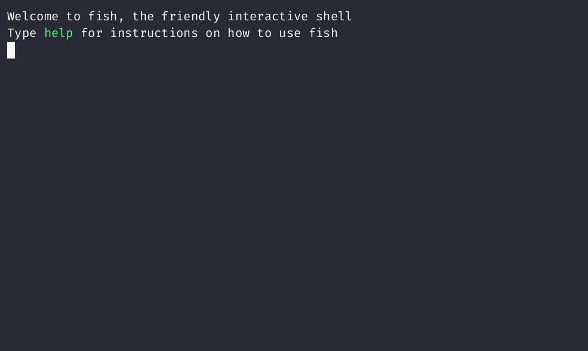
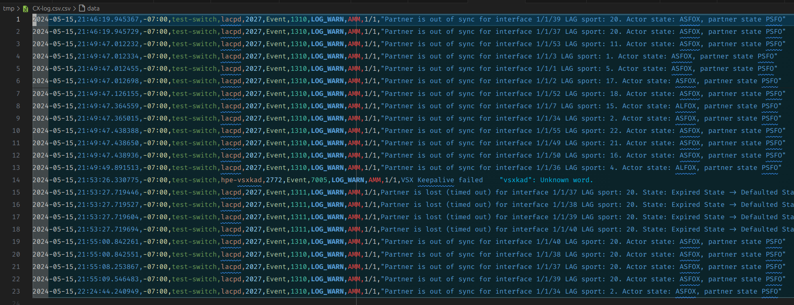

# Build a Great Terminal


----------------------------------------------------------------

:arrow_forward: KEY TAKEAWAYS

- We will install `Terminator` which has tabs, logging, and several available plugins.
- We will install z shell (ZSH) and set it as the default shell.
- Then we will install [Oh-My-ZSH](https://ohmyz.sh/) and configure it for awsomeness.
- We will enable syntax highlighting, autosuggestions, History-substring-search, git integration and docker aliases!!
- You will be the envy of your network engineering friends.

----------------------------------------------------------------

## Tailspin

**Overview**

tailspin works by reading through a log file line by line, running a series of regexes against each line. The regexes recognize patterns you expect to find in a log file, like dates, numbers, severity keywords and more.

tailspin does not make any assumptions on the format or position of the items it wants to highlight. For this reason, it requires no configuration and the highlighting will work consistently across different log files.

**Installation Instructions**

The repository is located here: [tailspin](https://github.com/bensadeh/tailspin). Tailspin is installed using `brew install tailspin`. There are instructions for tailspin on the README page at the repo.

A second tool, spacer, is very useful with tspin. The spacer repository is located [here](https://github.com/samwho/spacer). `spacer` is a simple CLI tool to insert spacers when command output stops.

If you're the type of person that habitually presses enter a few times in your log tail to know where the last request ended and the new one begins, this tool is for you!

Spacer is installed using `brew install spacer`.

----------------------------------------------------------------



----------------------------------------------------------------

### Windows

To use tailspin on Windows you will need WSL. See [How to install Homebrew on Windows](https://bobbyhadz.com/blog/how-to-install-brew-on-windows) for instructions.

### tspin examples

**For Linux logs**

- tspin --help
- tspin --print /var/log/ufw.log
- tspin --print /var/log/syslog
- journalctl -ef | tspin

Example using spacer

- journalctl -ef | tspin | spacer --after 5

```bash
2024-12-21 14:39:06 1.2s ━━━━━━━━━━━━━━━━━━━━━━━━━━━━━━━━━━━━━━━━━━━━━━━━━━━━━━━━━━━━━━━━━━━━━━━━━━━━━━━━━━━━━━━━━━━━━━━━━━━━━━━━━━━━━━━━━━━━━━━━━━━━
Dec 21 14:39:12 1S1K-G5-5587 smartd[2581]: Device: /dev/sda [SAT], SMART Usage Attribute: 190 Airflow_Temperature_Cel changed from 70 to 69
2024-12-21 14:39:14 7.4s ━━━━━━━━━━━━━━━━━━━━━━━━━━━━━━━━━━━━━━━━━━━━━━━━━━━━━━━━━━━━━━━━━━━━━━━━━━━━━━━━━━━━━━━━━━━━━━━━━━━━━━━━━━━━━━━━━━━━━━━━━━━━
Dec 21 14:40:01 1S1K-G5-5587 CRON[3541730]: pam_unix(cron:session): session opened for user mhubbard(uid=1000) by mhubbard(uid=0)
Dec 21 14:40:01 1S1K-G5-5587 CRON[3541734]: (mhubbard) CMD (clamav sleep $((RANDOM % 42)); venv/bin/fangfrisch --conf /etc/fangfrisch.conf refresh)
Dec 21 14:40:01 1S1K-G5-5587 systemd[1]: Starting sysstat-collect.service - system activity accounting tool...
Dec 21 14:40:01 1S1K-G5-5587 CRON[3541730]: pam_unix(cron:session): session closed for user mhubbard
Dec 21 14:40:01 1S1K-G5-5587 systemd[1]: sysstat-collect.service: Deactivated successfully.
Dec 21 14:40:01 1S1K-G5-5587 systemd[1]: Finished sysstat-collect.service - system activity accounting tool.
2024-12-21 14:40:03 49.0s ━━━━━━━━━━━━━━━━━━━━━━━━━━━━━━━━━━━━━━━━━━━━━━━━━━━━━━━━━━━━━━━━━━━━━━━━━━━━━━━━━━━━━━━━━━━━━━━━━━━━━━━━━━━━━━━━━━━━━━━━━━━
```

You can see the advantage of having `spacer` put a time stamp and line for each new log entry.

**Network Switch log file specific**

- tspin CX-log.txt --print
- tspin CX-log.txt --print | grep WARN
- tspin CX-log.txt --print | grep VSX

**Add on the fly colors**

- tspin CX-log.txt --print --words-red LOG_WARN --words-green AMM
- tspin CX-log.txt --print --words-red LOG_WARN,Partner --words-green AMM

----------------------------------------------------------------


----------------------------------------------------------------

**Use custom config file**

- tspin --print --config-path ~/.config/tailspin/cx-config.toml CX-log.txt
- tspin --print --config-path cx-config.toml CX-log.txt

**Add custom word list to color**

tspin uses .toml files for configuration. Here is a sample toml file for a CX switch log

```bash
[[keywords]]
words = ['LOG_WARN', 'Partner', 'AdjChg', 'Authorization', 'Authentication', 'User']
style = { fg = "red" }

[[keywords]]
words = ['LAG', 'VSX', 'LLDP']
style = { fg = "green", italic = true }
```

Here is one I'm working on for Cisco IOS/IOS-XE

```bash
[[keywords]]
words = ['LINK', 'CLEAR', 'LINEPROTO', 'UPDOWN', 'Configured', 'from', 'console', 'PARSER', 'SEC', 'SYS', 'CONFIG_I', 'SEC_LOGIN', 'LOGOUT', 'LOGIN_FAILED', 'LOGIN_SUCCESS', 'has exited tty session', 'SSH', 'SSH2_USERAUTH', 'SSH2_SESSION', 'SSH2_CLOSE', 'TTY_EXPIRE_TIMER']
style = { fg = "red" }

[[regexes]]
regex = 'GigabitEthernet\d{1,2}/\d{1,2}/\d{1,2}'
style = { fg = "red" }

[[keywords]]
words = ['LAG', 'vty', 'LLDP', 'CDP', 'GigabitEthernet']
style = { fg = "green", italic = true }

[[keywords]]
words = ['user', 'User', 'Interface']
style = { fg = "blue", bold = true, italic = false }

[[keywords]]
words = ['ILPOWER', 'DETECT', 'POWER_GRANTED', 'IEEE_DISCONNECT']
style = { fg = "magenta", bold = true}
```

You can create more `[[keywords]]` entries for other colors.

In the example above I created a directory `~/.config/tailspin/` to save the toml files in.

`mkdir -p ~/config/tailspin`

The `-p` argument will create parent directories if necessary.

**To use tspin with the custom file:**

`tspin --print --config-path ~/.config/tailspin/cx-config.toml CX-log.txt`

You could save the toml file in the same directory as the log file and use:
`tspin --print --config-path cx-config.toml CX-log.txt` but that doesn't scale well. I think it's better to put them in `~/.config/tailspin/` and then create an alias.

**alias example**

Place in `.zshrc`

alias tspincx='tspin --print --config-path ~/.config/tailspin/cx-config.toml $1'

To call the alias
`tspincx CX-log.txt`

## Log Parse

I wrote a python script that parses the CX log file into a csv file. The file can then be opened in Excel with each field of the file as a column. That allows you to sort and filter the log file.

If you use VS Code, you can install the `Rainbow CSV` extension and use SQL syntax to parse the file.

Here is a screenshot of the log file open and a query string to pull LOG_WARN messages:

----------------------------------------------------------------


----------------------------------------------------------------

And  a screenshot of the result file:



----------------------------------------------------------------

### Execution

Simply grab the CX-Log-Parse.py file from the repository and run:
`CX-Log-Parse.py -f CX-log.txt`

This will create a csv file with the name CX-log.csv.

**CX-Log-Parse**

Or you can copy the code here and save it to a plain text file

```python
import argparse
import csv
import re
import sys
from pathlib import Path

# "args": "-s area1 -c cisco -e 1 -l 1",

# Updated regex pattern to account for either a value like "1/1" or "-"
log_pattern = re.compile(
    r"(?P<date>\d{4}-\d{2}-\d{2})T(?P<time>\d{2}:\d{2}:\d{2}\.\d+)(?P<timezone>[+-]\d{2}:\d{2}) (?P<hostname>\S+) (?P<process>\S+)\[(?P<pid>\d+)\]: (?P<event_type>\S+)\|(?P<event_id>\d+)\|(?P<log_level>\S+)\|(?P<module>\S+)\|(?P<interface>(?:\S+|-)?)\|(?P<message>.+)"
)

parser = argparse.ArgumentParser()
parser.add_argument("-f", "--Log_filename", dest="Log_filename")
args = parser.parse_args()
Log_filename = args.Log_filename


if Log_filename is None:
    print("-f Log filename is a required argument")
    sys.exit()

csv_filename = Path(Log_filename).stem + ".csv"

# Get path and add Log Filename to it
my_dir = Path().resolve()
Log_file_Exists = my_dir.joinpath(Log_filename)

# Open log file and CSV file
if Log_file_Exists.exists():
    with (
        open(Log_filename, "r") as log_file,
        open(csv_filename, "w", newline="") as csv_file,
    ):
        csv_writer = csv.writer(csv_file)

        # Write CSV header
        csv_writer.writerow(
            [
                "Date",
                "Time",
                "Timezone",
                "Hostname",
                "Process",
                "PID",
                "Event Type",
                "Event ID",
                "Log Level",
                "Module",
                "Interface",
                "Message",
            ]
        )

        # Parse each log line
        for line in log_file:
            match = log_pattern.match(line)
            if match:
                # Write the captured groups to the CSV
                csv_writer.writerow(match.groups())
    print(f"Log file saved to: {csv_filename}")
else:
    print(f"Log file {Log_filename} does not exist")
    sys.exit()
```
