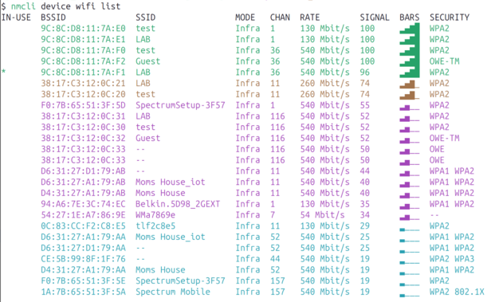
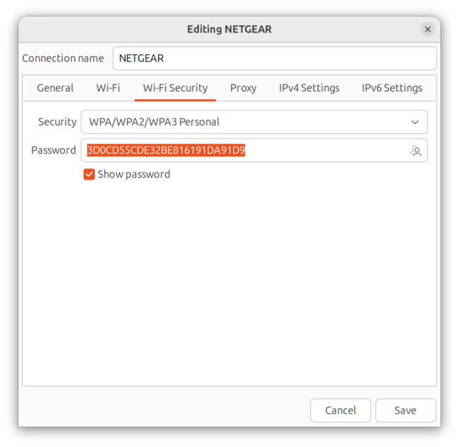

# Wireless tools

Linux offers a rich set of terminal tools for working with wireless networks. There are also graphical tools available. I'm going to start with my favorite GUI tool `Sparrow Wi-Fi`, which is a free, open source (FOSS) tool.

## Sparrow Wi-Fi

Overview from the GitHub site

[Sparrow-wifi](https://github.com/ghostop14/sparrow-wifi) has been built from the ground up to be the next generation 2.4 GHz and 5 GHz Wifi spectral awareness tool. At its most basic it provides a more comprehensive GUI-based replacement for tools like inSSIDer and linssid that runs specifically on linux. In its most comprehensive use cases, sparrow-wifi integrates

- wifi
- software-defined radio (hackrf)
- advanced bluetooth tools (traditional and Ubertooth)
- traditional GPS (via gpsd)
- drone/rover GPS via mavlink

all in one solution.

Written entirely in Python3, Sparrow-wifi has been designed for the following scenarios:

- Basic wifi SSID identification
- Wifi source hunt - Switch from normal to hunt mode to get multiple samples per second and use the telemetry windows to track a wifi source
- 2.4 GHz and 5 GHz spectrum view - Overlay spectrums from Ubertooth (2.4 GHz) or HackRF (2.4 GHz and 5 GHz) in real time on top of the wifi spectrum (invaluable in poor connectivity troubleshooting when overlapping wifi doesn't seem to be the cause)
- Bluetooth identification - LE advertisement listening with standard bluetooth, full promiscuous mode in LE and classic bluetooth with Ubertooth
- Bluetooth source hunt - Track LE advertisement sources or iBeacons with the telemetry window
- iBeacon advertisement - Advertise your own iBeacons
- Remote operations - An agent is included that provides all of the GUI functionality via a remote agent the GUI can talk to.
- Drone/Rover operations - The agent can be run on systems such as a Raspberry Pi and flown on a drone (its made several flights on a Solo 3DR), or attached to a rover in either GUI-controlled or autonomous scan/record modes.
- The remote agent is JSON-based so it can be integrated with other applications
- Import/Export - Ability to import and export to/from CSV and JSON for easy integration and revisiualization. You can also just run 'iw dev scan' and save it to a file and import that as well.
- Produce Google maps when GPS coordinates are available for both discovered SSID's / bluetooth devices or to plot the wifi telemetry over time.
- Integration with Elasticsearch to feed wireless and optionally bluetooth scan data into Elastic Common Schema compliant indices.

----------------------------------------------------------------

### Installation on Ubuntu 24.04 and newer

```bash
    git clone https://github.com/ghostop14/sparrow-wifi
    cd sparrow-wifi
    python -m venv venv --upgrade-deps --prompt="Sparrow"
    source venv/bin/activate
    which python3
```

You may have to use `which python3` depending on your system. You should see a path similar to this:

`/home/mhubbard/Insync/GD/04_Tools/sparrow-wifi/venv/bin/python3`

The path means that the virtual environment is working. If you see:

`/usr/bin/python3`

Stop! It means the venv didn't start correctly and you are working with your system python.

### Install the requirements

```bash
    pip3 install gps3 python-dateutil requests pyqt5 pyqtchart numpy matplotlib
    python -m pip install QScintilla gps3 dronekit manuf python-dateutil numpy matplotlib
```

**Verify the reqirements are installed:**

```bash hl_lines='1'
    pip list
Package            Version
------------------ -----------
certifi            2025.7.14
charset-normalizer 3.4.2
contourpy          1.3.3
cycler             0.12.1
dronekit           2.9.2
fastcrc            0.3.2
fonttools          4.59.0
gps3               0.33.3
idna               3.10
kiwisolver         1.4.8
lxml               6.0.0
manuf              1.1.5
matplotlib         3.10.5
monotonic          1.6
numpy              2.3.2
packaging          25.0
pillow             11.3.0
pip                25.2
pymavlink          2.4.48
pyparsing          3.2.3
PyQt5              5.15.11
PyQt5-Qt5          5.15.17
PyQt5_sip          12.17.0
PyQtChart          5.15.7
PyQtChart-Qt5      5.15.17
python-dateutil    2.9.0.post0
QScintilla         2.14.1
requests           2.32.4
six                1.17.0
urllib3            2.5.0
```

**Ubuntu 25.04 doesn't install the `wireless-tools` package by default**

 Sparrow-WiFi uses the Linux `iwconfig` tool from `wireless-tools`. Install it using:

```bash
sudo nala install wireless-tools
```

**Test iwconfig**

In this example, my wireless interface is wlp61s0

```bash
    iwconfig wlp61s0
    wlp61s0   IEEE 802.11  ESSID:"test"
          Mode:Managed  Frequency:5.18 GHz  Access Point: 9C:8C:D8:11:7A:F0
          Bit Rate=1.1342 Gb/s   Tx-Power=22 dBm
          Retry short limit:7   RTS thr:off   Fragment thr:off
          Power Management:on
          Link Quality=70/70  Signal level=-22 dBm
          Rx invalid nwid:0  Rx invalid crypt:0  Rx invalid frag:0
          Tx excessive retries:0  Invalid misc:8   Missed beacon:0
```

**Run sparrow-wifi**

!!! warning
    You have to include the path to the venv python because sparrow needs root access. Is you don't include the path, the `sudo` command will override the venv and call the system python

```bash
sudo /home/mhubbard/Insync/GD/04_Tools/sparrow-wifi/venv/bin/python3 sparrow-wifi.py
```

When `sparrow` starts up, click the `ip scan` button to start a scan.

----------------------------------------------------------------


----------------------------------------------------------------

#### Create a function to start sparrow

Below is a simple function that you can add to your `.zshrc` or custom zsh alias file. I prefer to put my custom functions into the zsh custom aliases file. Mine is at `~/.oh-my-zsh/custom/my-aliases.zsh` but you can use any name in the custom folder as long as the extension is `.zsh`

To add it to `.zshrc`:

```bash
nano ~/.zshrc
```

To add it to the custom `.zsh alias` file:

```bash
nano ~/.oh-my-zsh/custom/my-aliases.zsh
```

Then paste this function in:

```bash
sparrow () {
    cd ~/Insync/GD/04_Tools/sparrow-wifi
    source venv/bin/activate
    sudo /home/mhubbard/Insync/GD/04_Tools/sparrow-wifi/venv/bin/python3    sparrow-wifi.py
}
```

Use `ctrl+x` to exit `nano`, press `y` to save the file.

Type `exec zsh` to reload the shell

Now you can enter `sparrow` to start `sparrow-wifi` without manually entering all the commands.

----------------------------------------------------------------

## Wireless Terminal commands

Linux has many built-in or freely available terminal based tools for viewing information the wireless Interface.

### Display SSIDs

To get a quick, static, view of all SSIDs visible to your laptop:

`nmcli device wifi list`

----------------------------------------------------------------



----------------------------------------------------------------

### List all connections

This command will list all connections on your laptop. The TYPE column lists the connection type and the DEVICE column lists the interface that is connected. This list will grow long for a network engineer because every SSID is recorded.

```bash hl_lines='1'
nmcli connection show
NAME                UUID                                  TYPE      DEVICE
Work                4adc6bf7-3a1c-4c0d-af1a-709974497468  ethernet  enx0050b61ca0c0
LAB                 d135c39f-bcc1-4666-9951-6d5c32c3bf94  wifi      wlp61s0
lo                  2a4b667f-68db-47bd-bb6c-a396b833b671  loopback  lo
virbr0              231172c6-33ab-4176-81aa-950b75b55e27  bridge    virbr0
vnet0               3d320508-d381-4a78-9ad4-b235b2a28828  tun       vnet0
Home-Lab            3d160ffd-982d-46d2-8f87-de9cb9a87e13  ethernet  --
NETGEAR             5a899d4d-5af0-4d6b-b999-a1897709fd0c  wifi      --
Profile 1           d05e76a7-292b-4841-9933-d78fe78c0494  ethernet  --
test                e6e95de6-0825-4c72-8da4-4b0c54f86264  wifi      --
Wired connection 1  c23c0b73-a5f9-3e45-b074-7b03f8d269e2  ethernet  --
```

----------------------------------------------------------------

### Display the SSID and password

This is useful is you need to share the password of a wireless network. A mobile phone can scan the QR code to connect:

```bash linenums='1' hl_lines='1'
sudo nmcli -a -p device wifi show-password ifname wlp61s0
SSID: LAB
Security: WPA
Password: Guest123456
```


----------------------------------------------------------------

### List WiFi properties

Show details for the SSID "test" connection with the `preshared key password` (PSK).
Note: without --show-secrets option, secrets would not be displayed.

`nmcli --show-secrets connection show "test"`

If you are looking for a PSK password, you can pipe the output to grep:

```bash hl_lines='1'
nmcli --show-secrets connection show test | grep security.psk
802-11-wireless-security.psk:           SuperSecretPasswd
```

The advantage of this over the `sudo nmcli -a -p device wifi show-password ifname wlp61s0` command is that you don't have to be connected to the SSID to retrieve the password.

List all available connection profiles for the Wi-Fi interface wlp61s0.
`nmcli -f CONNECTIONS device show wlp61s0`

List only GENERAL and WIFI-PROPERTIES sections for wlp61s0

```bash linenums='1' hl_lines='1 9-11'
nmcli -f GENERAL,WIFI-PROPERTIES dev show wlp61s0
nmcli -f GENERAL,WIFI-PROPERTIES dev show wlp61s0
GENERAL.DEVICE:                         wlp61s0
GENERAL.TYPE:                           wifi
GENERAL.NM-TYPE:                        NMDeviceWifi
GENERAL.DBUS-PATH:                      /org/freedesktop/NetworkManager/Devices/4
GENERAL.VENDOR:                         Intel Corporation
GENERAL.PRODUCT:                        Wi-Fi 6E(802.11ax) AX210/AX1675* 2x2 [Typhoon Peak] (Wi-Fi 6 AX210 160MHz)
GENERAL.DRIVER:                         iwlwifi
GENERAL.DRIVER-VERSION:                 6.14.0-24-generic
GENERAL.FIRMWARE-VERSION:               89.4d42c933.0 ty-a0-gf-a0-89.uc
GENERAL.HWADDR:                         28:D0:EA:93:2A:42
GENERAL.MTU:                            1500
GENERAL.STATE:                          100 (connected)
GENERAL.REASON:                         0 (No reason given)
GENERAL.IP4-CONNECTIVITY:               4 (full)
GENERAL.IP6-CONNECTIVITY:               4 (full)
GENERAL.UDI:                            /sys/devices/pci0000:00/0000:00:1d.6/0000:3d:00.0/net/wlp61s0
GENERAL.PATH:                           pci-0000:3d:00.0
GENERAL.IP-IFACE:                       wlp61s0
GENERAL.IS-SOFTWARE:                    no
GENERAL.NM-MANAGED:                     yes
GENERAL.AUTOCONNECT:                    yes
GENERAL.FIRMWARE-MISSING:               no
GENERAL.NM-PLUGIN-MISSING:              no
GENERAL.PHYS-PORT-ID:                   --
GENERAL.CONNECTION:                     LAB
GENERAL.CON-UUID:                       d135c39f-bcc1-4666-9951-6d5c32c3bf94
GENERAL.CON-PATH:                       /org/freedesktop/NetworkManager/ActiveConnection/36
GENERAL.METERED:                        no (guessed)
WIFI-PROPERTIES.WEP:                    yes
WIFI-PROPERTIES.WPA:                    yes
WIFI-PROPERTIES.WPA2:                   yes
WIFI-PROPERTIES.TKIP:                   yes
WIFI-PROPERTIES.CCMP:                   yes
WIFI-PROPERTIES.AP:                     yes
WIFI-PROPERTIES.ADHOC:                  yes
WIFI-PROPERTIES.2GHZ:                   yes
WIFI-PROPERTIES.5GHZ:                   yes
WIFI-PROPERTIES.6GHZ:                   yes
WIFI-PROPERTIES.MESH:                   no
WIFI-PROPERTIES.IBSS-RSN:               yes
```

This command is nice because it lists the:

- Chip vendor - Intel
- The chip model, a Wi-Fi 6E, AX210 in this case.
- The driver the chip is using, iwlwifi
- The driver version, 6.14.0.24
- The firmware version, 89.4d42c933.0 ty-a0-gf-a0-89.uc
- The Hardware address

----------------------------------------------------------------

### iwconfig

This is an oldie but goodie in Linux!

`iwconfig` is part of the `wireless-tools` for Linux package maintained by Jean Tourrilhes.

**Ubuntu 25.04 doesn't install the `wireless-tools` package by default**

If you didn't install `Sparrow-WiFi` above, install `wireless-tools` using:

```bash
sudo nala install wireless-tools
```

**Test iwconfig**

In this example, my wireless interface is wlp61s0

```bash
    iwconfig wlp61s0
    wlp61s0   IEEE 802.11  ESSID:"test"
          Mode:Managed  Frequency:5.18 GHz  Access Point: 9C:8C:D8:11:7A:F0
          Bit Rate=1.1342 Gb/s   Tx-Power=22 dBm
          Retry short limit:7   RTS thr:off   Fragment thr:off
          Power Management:on
          Link Quality=70/70  Signal level=-22 dBm
          Rx invalid nwid:0  Rx invalid crypt:0  Rx invalid frag:0
          Tx excessive retries:0  Invalid misc:8   Missed beacon:0
```

From the MAN pages:

Iwconfig is similar to ifconfig(8), but is dedicated to the wireless interfaces. It is used to set the parameters of the network interface which are specific to the wireless operation (for example: the frequency). Iwconfig may also be used to display those parameters, and the wireless statistics (extracted from /proc/net/wireless).

That last line means that we can display wireless interface statistics using the Linux watch command. Watch is a tool that runs a command at a regular interval and displays the output to the screen. The default is 2 seconds, -n1 sets it to 1 second.

`watch -n1 iwconfig`

```text
wlp61s0   IEEE 802.11  ESSID:"test"
          Mode:Managed  Frequency:5.18 GHz  Access Point: 9C:8C:D8:11:7A:F0
          Bit Rate=1.2009 Gb/s   Tx-Power=22 dBm
          Retry short limit:7   RTS thr:off   Fragment thr:off
          Power Management:on
          Link Quality=70/70  Signal level=-24 dBm
          Rx invalid nwid:0  Rx invalid crypt:0  Rx invalid frag:0
          Tx excessive retries:0  Invalid misc:8   Missed beacon:0
```

This is useful when restarting an AP or troubleshooting wireless. With `watch` running, you can glance at the screen and see if the interface is connected.

You can also use `watch` with an ethernet interface. In this example I was connected to a switch that I needed to reboot. I wanted to monitor the Ethernet interface and know when it was back up. The default time for watch is 2 seconds but you can override that with the -n (interval) switch. In this case 2 seconds was fine.

`watch ip address show enx0050b61ca0c0`

```bash
10: enx0050b61ca0c0: <NO-CARRIER,BROADCAST,MULTICAST,UP> mtu 1500 qdisc fq_codel state DOWN group default qlen 1000
    link/ether 00:50:b6:1c:a0:c0 brd ff:ff:ff:ff:ff:ff

10: enx0050b61ca0c0: <BROADCAST,MULTICAST,UP,LOWER_UP> mtu 1500 qdisc fq_codel state UP group default qlen 1000
    link/ether 00:50:b6:1c:a0:c0 brd ff:ff:ff:ff:ff:ff
    inet 192.168.10.130/24 brd 192.168.10.255 scope global dynamic noprefixroute enx0050b61ca0c0
       valid_lft 3567sec preferred_lft 3567sec
    inet6 fd24:42b2:12ce:0:756c:178d:b308:c785/64 scope global temporary dynamic
       valid_lft 604769sec preferred_lft 86063sec
    inet6 fd24:42b2:12ce:0:f5af:c424:4a19:d4e6/64 scope global dynamic mngtmpaddr noprefixroute
       valid_lft 2591982sec preferred_lft 604782sec
    inet6 fe80::2c7f:3933:39b9:ac0e/64 scope link noprefixroute
       valid_lft forever preferred_lft forever
```

You can see that initially the interface was down with no IP Address, then `watch` refreshes and the port has an ip address.

----------------------------------------------------------------

### iwgetid

The iwgetid command is designed to be used with shell or Perl scripts. You get the same output as iwconfig but in a format that makes it easy to save in a variable. You can tell the command is old because the scheme switch outputs in a format for PCMCIA cards!

```text
iwgetid -h
Usage iwgetid [OPTIONS] [ifname]
  Options are:
    -a,--ap       Print the access point address
    -c,--channel  Print the current channel
    -f,--freq     Print the current frequency
    -m,--mode     Print the current mode
    -p,--protocol Print the protocol name
    -r,--raw      Format the output as raw value for shell scripts
    -s,--scheme   Format the output as a PCMCIA scheme identifier
    -h,--help     Print this message
```

**Examples**

```bash hl_lines='1 4 7 10 13 16 19 22'
iwgetid -a
wlp61s0   Access Point/Cell: 9C:8C:D8:11:7A:F0

iwgetid -a -r
9C:8C:D8:11:7A:F0

iwgetid -f
wlp61s0   Frequency:5.18 GHz

iwgetid -f -r
5.18e+09

iwgetid -m
wlp61s0   Mode:Managed

iwgetid -m -r
2

iwgetid -p
wlp61s0   Protocol Name:"IEEE 802.11"

iwgetid -s
test
```

#### A function for iwgetid

Below is a simple function that you can add to your `.zshrc` or or custom zsh alias file. I prefer to put my custom functions into the zsh custom aliases file. Mine is at `~/.oh-my-zsh/custom/my-aliases.zsh` but you can use any name in the custom folder as long as the extension is `.zsh`

To add it to `.zshrc`:

```bash
nano ~/.zshrc
```

To add it to the custom `.zsh alias` file:

```bash
nano ~/.oh-my-zsh/custom/my-aliases.zsh
```

Then paste this function in:

```bash
iwget () {
    APMac=`iwgetid -ar`
    IntFace=`iwgetid -f`
    ID=`iwgetid -s`
    echo "AP Mac:" $APMac && echo "Interface:" $IntFace && echo "SSID:" $ID
}
```

Use `ctrl+x` to exit `nano`, press `y` to save the file.

Type `exec zsh` to reload the shell

Now you can enter

```bash hl_lines='1'
iwget
AP Mac: 9C:8C:D8:11:7A:F0
Interface: wlp61s0   Frequency:5.18 GHz
SSID: test
```

----------------------------------------------------------------

### iwlist

From the man page:

Name “iwlist - Get more detailed wireless information from a wireless interface”.

#### Description

Iwlist is used to display some additional information from a wireless‐network interface that is not displayed by iwconfig(8). The main argument is used to select a category of information, iwlist displays in detailed form all information related to this category, including information already shown by iwconfig(8).

Options

- iwlist [interface] scanning
- iwlist [interface] frequency
- iwlist [interface] rate
- iwlist [interface] keys
- iwlist [interface] power
- iwlist [interface] txpower
- iwlist [interface] retry
- iwlist [interface] event
- iwlist [interface] auth
- iwlist [interface] wpakeys
- iwlist [interface] genie
- iwlist [interface] modulation
- iwlist --help
- iwlist –version

With this one iwlist command you will get detailed information about all the APs your card can see:

```bash hl_lines='1'
iwlist wlp61s0 scanning
wlp61s0   Scan completed :
          Cell 01 - Address: 9C:8C:D8:11:7A:F0
                    Channel:36
                    Frequency:5.18 GHz (Channel 36)
                    Quality=70/70  Signal level=-23 dBm
                    Encryption key:on
                    ESSID:"test"
                    Bit Rates:12 Mb/s; 18 Mb/s; 24 Mb/s; 36 Mb/s; 48 Mb/s
                              54 Mb/s
                    Mode:Master
                    Extra:tsf=000000292b2a65bb
                    Extra: Last beacon: 3526ms ago
                    IE: Unknown: 000474657374
                    IE: Unknown: 01069824B048606C
                    IE: Unknown: 030124
                    IE: IEEE 802.11i/WPA2 Version 1
                        Group Cipher : CCMP
                        Pairwise Ciphers (1) : CCMP
                        Authentication Suites (1) : PSK
```

**In this example:**

Cell – Address: 9C:8C:D8:11:7A:F0 is the radio MAC of the AP

IE stands for Generic Information Events. I do not know how to decode them!

**Transmit Power**

Note that the power switch requires sudo.

**sudo iwlist wlp61s0 txpower**

wlp61s0 unknown transmit-power information.

Current Tx-Power=22 dBm (158 mW)

**Bit Rate**

**iwlist wlp61s0 rate**

wlp61s0 unknown bit-rate information.

Current Bit Rate:866.7 Mb/s

**More Information**

[Get more detailed wireless information from a wireless interface](http://www.linux-commands-examples.com/iwlist)

### Display Saved Networks

When you connect to a network, the settings, including the username/password, are saved. To view them, open a terminal and enter:

```bash
nm-connection-editor
```

A GUI will open and you can select a saved SSID:

----------------------------------------------------------------


----------------------------------------------------------------

#### Display the password

If you click on an SSID, then click the `gear` icon, Wi-Fi Security, it will open a new dialog where you can change the Security type and view/change the password.

----------------------------------------------------------------



----------------------------------------------------------------

### Wavemon

Another wireless monitoring tool for Ubuntu.

#### Installation

`sudo nala install wavemon`

From the MAN pages - Wavemon is an ncurses-based monitoring application for wireless network devices. It plots levels in real-time as well as showing wireless and network related device information.

The wavemon interface splits into different "screens". Each screen presents information in a specific manner. For example, the "info" screen shows current levels as bargraphs, whereas the "level" screen represents the same levels as a moving histogram.

Run wavemon with sudo to get the most information.

***sudo wavemon***

By default, it opens on the information screen.

You can press “s” to bring up the scanning screen. This is useful to see all of the SSIDs your laptop can see along with AP MAC, signal quality, power, channel and frequency.

Note that you can see “hidden” SSIDs also.

----------------------------------------------------------------


----------------------------------------------------------------

### Cheat Sheets

[Ubuntu server Cheat Sheet](https://www.cheatography.com/nielzzz/cheat-sheets/ububtu-server/)
[Linux Bash Shell Cheat Sheet](https://learncodethehardway.org/unix/bash_cheat_sheet.pdf)
[Linux Commands Cheat Sheet](https://www.linuxtrainingacademy.com/linux-commands-cheat-sheet/)
